# Application Workflows

This document traces the backend's most important runtime flows end to end: **background jobs**, **authentication**, and **purchase / payment processing**. Each flow is shown as a Mermaid `sequenceDiagram`, which renders directly on GitHub, in VS Code Markdown preview, and in most Markdown viewers.

> Related: [`Architecture.md`](Architecture.md) for layering and the request pipeline, [`Security.md`](Security.md) for authentication and authorization rules, [`Database-Design.md`](Database-Design.md) for the tables these flows touch, [`Patterns-Decisions.md`](Patterns-Decisions.md) for why the code is shaped this way.

> **Scope — backend only.** Every step below describes `backend/src`. The React client appears only where it genuinely participates (posting credentials, following a checkout redirect).

## Participant legend

| Participant | Real type |
| --- | --- |
| `Client` | Browser / React app — or, for the webhook, the Chargily gateway |
| `Endpoint` | FastEndpoints endpoint under `Api/Endpoints/...` |
| `Pipeline` | MediatR pipeline: exception, logging, validation, and performance behaviours |
| `Handler` | Command or query handler under `Application/Features/...` |
| `Domain` | Entities and value objects under `Domain/...` |
| `Port` | Application interface under `Application/Common/Interfaces/...` |
| `Adapter` | Infrastructure implementation under `Infrastructure/...` |
| `DB` | PostgreSQL, reached through EF Core |

---

## 1. Background Jobs

### 1.1 How the job system is wired

Background work runs on [TickerQ](https://tickerq.net/). The important architectural point is that **the application layer never references TickerQ**. Handlers depend on `IEmailJob` and `IImageCleanupJob`; only the infrastructure implementations know about the scheduler.

| Concern | Location |
| --- | --- |
| Scheduler registration | `services.AddTickerQ()` in `Api/DependencyInjection.cs` |
| Scheduler middleware | `app.UseTickerQ()` in `Api/Program.cs` |
| Application contracts | `Application/Common/Interfaces/BackgroundJobs/IEmailJob.cs`, `IImageCleanupJob.cs` |
| Job implementations | `Infrastructure/BackgroundJobs/EmailJob.cs`, `ImageCleanupJob.cs` |
| Liveness tracking | `Infrastructure/BackgroundJobs/BackgroundJobTracker.cs` |
| Health probe | `Infrastructure/HealthChecks/BackgroundJobHealthCheck.cs` |

A method becomes a job handler through the `[TickerFunction(functionName: "...")]` attribute. Scheduling a job means enqueuing a `TimeTickerEntity` with a function name, an execution time, and a serialized payload:

```csharp
await _tickerManager.AddAsync(new TimeTickerEntity
{
    Function = "SendVerificationCode",
    ExecutionTime = DateTime.UtcNow,
    Request = TickerHelper.CreateTickerRequest(new SendCodePayload(email, code))
}, cancellationToken);
```

Every scheduling call uses `ExecutionTime = DateTime.UtcNow`, so jobs are **queued for immediate execution**, not scheduled for a future date. TickerQ persists the ticker, invokes it outside the HTTP request, and the job class records a heartbeat when it finishes.

### 1.2 Registered jobs

| Job class | TickerQ function | Payload | Scheduled by | Effect |
| --- | --- | --- | --- | --- |
| `EmailJob` | `SendVerificationCode` | `SendCodePayload(Email, Code)` | `RegisterCommandHandler`, `ResendCodeCommandHandler` | Sends the email-verification code |
| `EmailJob` | `SendPasswordResetCode` | `SendCodePayload(Email, Code)` | `ForgotPasswordCommandHandler`, `ResendCodeCommandHandler` | Sends the password-reset code |
| `EmailJob` | `SendPurchaseNotification` | `SendPurchaseNotificationPayload` | `PaymentWebhookCommandHandler` (paid only) | Sends the order details email to the admin address |
| `ImageCleanupJob` | `DeleteImages` | `List<string>` of image URLs | Product and category create / update / delete handlers | Deletes image files from disk |

`ScheduleSendPurchaseNotificationAsync` is the one scheduling method that does database work before enqueuing: it loads the user through `IUserRepository`, builds `LastName + " " + FirstName`, and reads `user.PhoneNumber.Value`. If the user cannot be found, it logs an error and returns without scheduling anything.

### 1.3 Scheduling flow

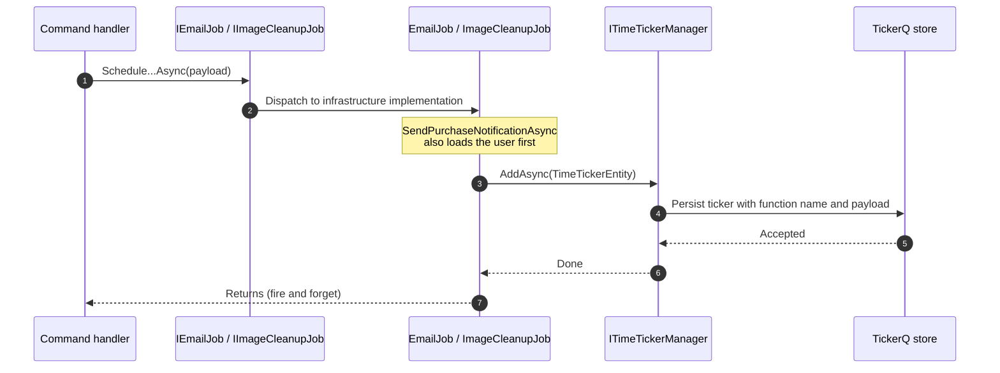
```mermaid
sequenceDiagram
    autonumber
    participant Handler as Command handler
    participant Port as IEmailJob / IImageCleanupJob
    participant Job as EmailJob / ImageCleanupJob
    participant Ticker as ITimeTickerManager
    participant Store as TickerQ store

    Handler->>Port: Schedule...Async(payload)
    Port->>Job: Dispatch to infrastructure implementation
    Note over Job: SendPurchaseNotificationAsync<br/>also loads the user first
    Job->>Ticker: AddAsync(TimeTickerEntity)
    Ticker->>Store: Persist ticker with function name and payload
    Store-->>Ticker: Accepted
    Ticker-->>Job: Done
    Job-->>Handler: Returns (fire and forget)
```

The handler does not wait for the email to be delivered. It waits only until the ticker is persisted, which keeps SMTP latency out of the HTTP response.

### 1.4 Execution flow

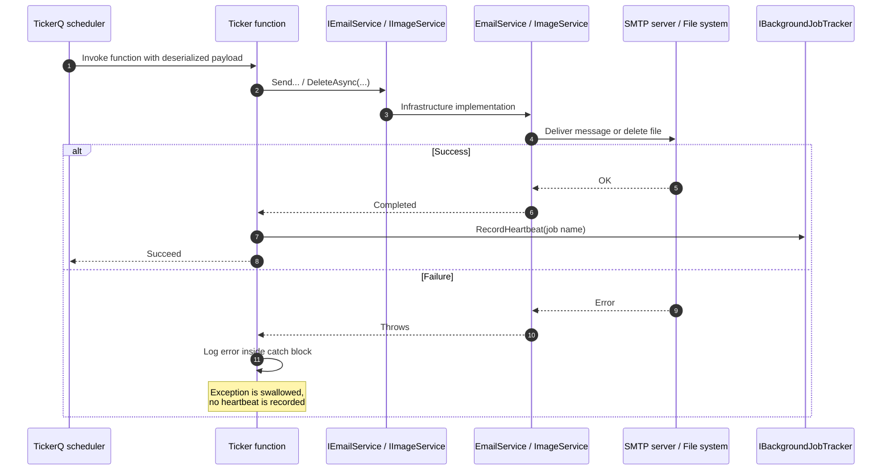
```mermaid
sequenceDiagram
    autonumber
    participant Ticker as TickerQ scheduler
    participant Job as Ticker function
    participant Port as IEmailService / IImageService
    participant Adapter as EmailService / ImageService
    participant Third as SMTP server / File system
    participant Tracker as IBackgroundJobTracker

    Ticker->>Job: Invoke function with deserialized payload
    Job->>Port: Send... / DeleteAsync(...)
    Port->>Adapter: Infrastructure implementation
    Adapter->>Third: Deliver message or delete file
    alt Success
        Third-->>Adapter: OK
        Adapter-->>Job: Completed
        Job->>Tracker: RecordHeartbeat(job name)
        Job-->>Ticker: Succeed
    else Failure
        Third-->>Adapter: Error
        Adapter-->>Job: Throws
        Job->>Job: Log error inside catch block
        Note over Job: Exception is swallowed,<br/>no heartbeat is recorded
    end
```

Every job wraps its work in a `try` / `catch` and **logs rather than rethrows**. `ImageCleanupJob` additionally treats `FileNotFoundException` as a warning, because a missing file means the cleanup it was asked to do has already happened.

### 1.5 Heartbeats and health checks

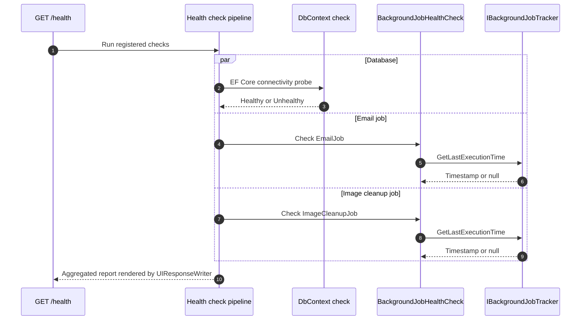
```mermaid
sequenceDiagram
    autonumber
    participant Probe as GET /health
    participant HC as Health check pipeline
    participant DB as DbContext check
    participant JobHC as BackgroundJobHealthCheck
    participant Tracker as IBackgroundJobTracker

    Probe->>HC: Run registered checks
    par Database
        HC->>DB: EF Core connectivity probe
        DB-->>HC: Healthy or Unhealthy
    and Email job
        HC->>JobHC: Check EmailJob
        JobHC->>Tracker: GetLastExecutionTime
        Tracker-->>JobHC: Timestamp or null
    and Image cleanup job
        HC->>JobHC: Check ImageCleanupJob
        JobHC->>Tracker: GetLastExecutionTime
        Tracker-->>JobHC: Timestamp or null
    end
    HC-->>Probe: Aggregated report rendered by UIResponseWriter
```

`BackgroundJobTracker` is an in-memory `ConcurrentDictionary<string, DateTime>` registered as a singleton, so heartbeats are **per process and lost on restart**. `BackgroundJobHealthCheck` reports:

- **Healthy (idle)** when the job has never run since startup — the message explicitly says this is not treated as a failure.
- **Degraded** when a `maxAllowedStaleInterval` is configured and exceeded.
- **Healthy** with elapsed time otherwise.

In `Infrastructure/DependencyInjection.cs` both jobs are registered **without** a `maxAllowedStaleInterval`, so the degraded path is currently unreachable and the check only proves the job ran at least once.

### 1.6 Known limitations

- **Swallowed failures.** Because every job catches and logs, TickerQ sees a completed ticker even when the email or file deletion failed. No retry-on-failure or dead-letter behaviour is configured, so a failed verification email is only visible in the logs.
- **In-memory heartbeats.** A process restart resets all heartbeats and the check returns "idle" rather than "unhealthy".
- **No recurring jobs.** Everything is enqueued with `ExecutionTime = DateTime.UtcNow`. There is no cron-style job and no periodic sweep for stale data such as expired verification tokens or revoked refresh tokens.

---

## 2. Authentication Workflows

All ten authentication endpoints live in the `AuthGroup`, which sets the `api/auth` prefix and `AllowAnonymous()` for the whole group. Abuse protection is layered on top with IP-based policies for every endpoint and an additional per-identity limiter for the ones that accept credentials or issue codes.

| Flow | Endpoint | Route | Rate limiting |
| --- | --- | --- | --- |
| Register | `Register.cs` | `POST /api/auth/register` | `auth-ip-create` — 10 / min / IP |
| Verify email | `VerifyEmail.cs` | `POST /api/auth/verify-email` | `auth-email-strict` — 5 / min / email |
| Log in | `LogIn.cs` | `POST /api/auth/login` | `auth-ip-spray-guard` — 20 / min / IP, plus `auth-email-strict` — 5 / min / email |
| Refresh | `Refresh.cs` | `POST /api/auth/refresh` | `auth-ip-relaxed` — 30 / min / IP |
| Log out | `LogOut.cs` | `POST /api/auth/logout` | `standard` — 100 / min / IP |
| Forgot password | `ForgotPassword.cs` | `POST /api/auth/forgot-password` | `auth-target-strict` — 3 / 15 min / email |
| Reset password | `ResetPassword.cs` | `POST /api/auth/reset-password` | `auth-email-strict` — 5 / min / email |
| Resend code | `ResendCode.cs` | `POST /api/auth/resend-code` | `auth-target-strict` — 3 / 15 min / email |
| Google register | `ExternalAuthRegister.cs` | `POST /api/auth/google/register` | `auth-ip-relaxed` — 30 / min / IP |
| Google log in | `ExternalAuthLogin.cs` | `POST /api/auth/google/login` | `auth-ip-relaxed` — 30 / min / IP |

The two per-identity limiters are deliberately assigned by *cost*, not by endpoint family:

- **`auth-email-strict`** (5 / min per email) guards the endpoints where a caller supplies something they must already know or is guessing a code: `login`, `verify-email`, and `reset-password`.
- **`auth-target-strict`** (3 / 15 min per email) guards the endpoints that *cause a new code to be generated and emailed*: `forgot-password` and `resend-code`. This is the tighter budget because those calls cost an email and open code-guessing windows.

Worth stating explicitly, because the name invites the wrong assumption: **`auth-target-strict` does not guard `verify-email`.** Verification is limited by `auth-email-strict`, since the caller must already possess the code — it spends no email budget. The `target` limiter is about *issuing* codes, not *spending* them. `Security.md` describes it as verification-code abuse protection, which is accurate but easy to misread as covering the verify endpoint itself.

Sections 2.1 to 2.7 diagram the seven flows that issue or renew a session — register, verify email, local log in, Google register, Google log in, refresh, and password reset. Section 2.8 covers the two remaining endpoints, resend code and log out. Together the ten rows above account for every endpoint in the `AuthGroup`; none is omitted.

Three token rules apply to every flow that issues a session:

- The **access token** is a JWT signed with HMAC-SHA256, valid for `JwtSettings.TokenExpirationInMinutes` (15 minutes in configuration), and returned in the **response body** only.
- The **refresh token** is 64 random bytes, Base64-encoded, valid for **7 days**, and returned only as an `HttpOnly` cookie scoped to `Path=/api/auth`.
- Only the **SHA-256 hash** of the refresh token is persisted (`ITokenHasherService.HashToken`), so a database leak does not expose usable tokens.

### 2.1 Register (local credentials)

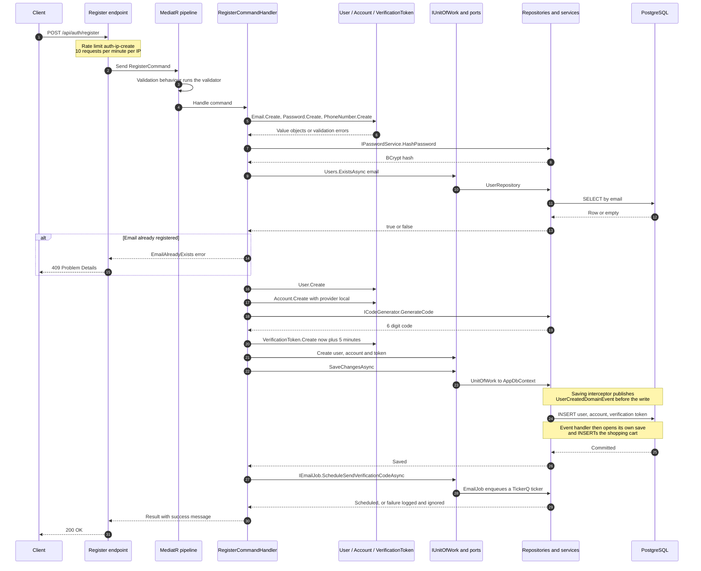
```mermaid
sequenceDiagram
    autonumber
    participant Client
    participant Endpoint as Register endpoint
    participant Pipeline as MediatR pipeline
    participant Handler as RegisterCommandHandler
    participant Domain as User / Account / VerificationToken
    participant Port as IUnitOfWork and ports
    participant Adapter as Repositories and services
    participant DB as PostgreSQL

    Client->>Endpoint: POST /api/auth/register
    Note over Endpoint: Rate limit auth-ip-create<br/>10 requests per minute per IP
    Endpoint->>Pipeline: Send RegisterCommand
    Pipeline->>Pipeline: Validation behaviour runs the validator
    Pipeline->>Handler: Handle command

    Handler->>Domain: Email.Create, Password.Create, PhoneNumber.Create
    Domain-->>Handler: Value objects or validation errors
    Handler->>Adapter: IPasswordService.HashPassword
    Adapter-->>Handler: BCrypt hash

    Handler->>Port: Users.ExistsAsync email
    Port->>Adapter: UserRepository
    Adapter->>DB: SELECT by email
    DB-->>Adapter: Row or empty
    Adapter-->>Handler: true or false
    alt Email already registered
        Handler-->>Endpoint: EmailAlreadyExists error
        Endpoint-->>Client: 409 Problem Details
    end

    Handler->>Domain: User.Create
    Handler->>Domain: Account.Create with provider local
    Handler->>Adapter: ICodeGenerator.GenerateCode
    Adapter-->>Handler: 6 digit code
    Handler->>Domain: VerificationToken.Create now plus 5 minutes

    Handler->>Port: Create user, account and token
    Handler->>Port: SaveChangesAsync
    Port->>Adapter: UnitOfWork to AppDbContext
    Note over Adapter,DB: Saving interceptor publishes<br/>UserCreatedDomainEvent before the write
    Adapter->>DB: INSERT user, account, verification token
    Note over Adapter,DB: Event handler then opens its own save<br/>and INSERTs the shopping cart
    DB-->>Adapter: Committed
    Adapter-->>Handler: Saved

    Handler->>Port: IEmailJob.ScheduleSendVerificationCodeAsync
    Port->>Adapter: EmailJob enqueues a TickerQ ticker
    Adapter-->>Handler: Scheduled, or failure logged and ignored

    Handler-->>Endpoint: Result with success message
    Endpoint-->>Client: 200 OK
```

Two details are easy to miss:

- **Registration performs two saves.** The user, account, and verification token are inserted first; then `DispatchDomainEventsInterceptor` publishes `UserCreatedDomainEvent`, and `UserCreatedDomainEventHandler` creates the cart and saves again. A failure in the second save would leave a user without a cart, because the two writes are not one transaction.
- **Email scheduling cannot fail registration.** The `ScheduleSendVerificationCodeAsync` call sits in a `try` / `catch` that logs the failure. A user can therefore be created successfully and still never receive a code.

The role is parsed leniently: `Enum.TryParse<Role>(request.Role, ignoreCase: true, ...)` falls back to `Role.Customer` when the value is missing or unrecognised, so the endpoint cannot be used to force an invalid role — but it also silently ignores a typo such as `"Admni"`.

### 2.2 Verify email

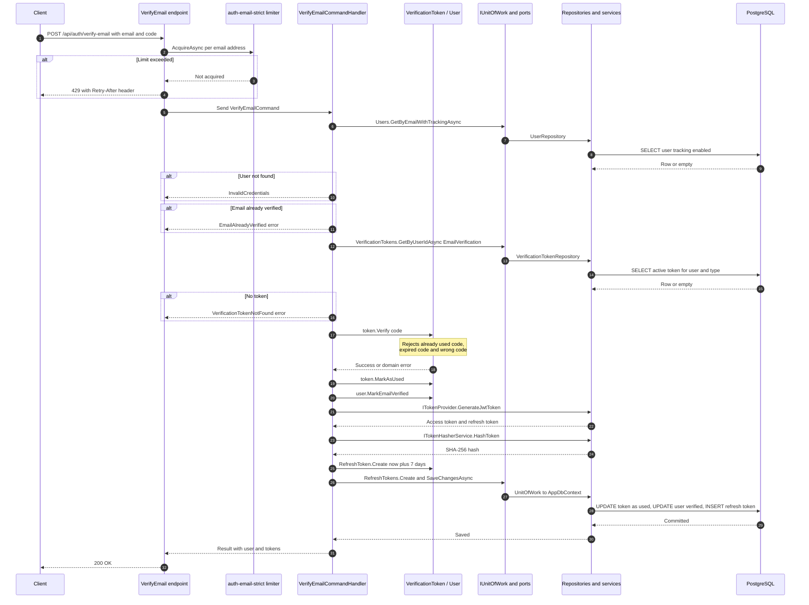
```mermaid
sequenceDiagram
    autonumber
    participant Client
    participant Endpoint as VerifyEmail endpoint
    participant Limiter as auth-email-strict limiter
    participant Handler as VerifyEmailCommandHandler
    participant Domain as VerificationToken / User
    participant Port as IUnitOfWork and ports
    participant Adapter as Repositories and services
    participant DB as PostgreSQL

    Client->>Endpoint: POST /api/auth/verify-email with email and code
    Endpoint->>Limiter: AcquireAsync per email address
    alt Limit exceeded
        Limiter-->>Endpoint: Not acquired
        Endpoint-->>Client: 429 with Retry-After header
    end

    Endpoint->>Handler: Send VerifyEmailCommand
    Handler->>Port: Users.GetByEmailWithTrackingAsync
    Port->>Adapter: UserRepository
    Adapter->>DB: SELECT user tracking enabled
    DB-->>Adapter: Row or empty
    alt User not found
        Handler-->>Endpoint: InvalidCredentials
    end
    alt Email already verified
        Handler-->>Endpoint: EmailAlreadyVerified error
    end

    Handler->>Port: VerificationTokens.GetByUserIdAsync EmailVerification
    Port->>Adapter: VerificationTokenRepository
    Adapter->>DB: SELECT active token for user and type
    DB-->>Adapter: Row or empty
    alt No token
        Handler-->>Endpoint: VerificationTokenNotFound error
    end

    Handler->>Domain: token.Verify code
    Note over Domain: Rejects already used code,<br/>expired code and wrong code
    Domain-->>Handler: Success or domain error
    Handler->>Domain: token.MarkAsUsed
    Handler->>Domain: user.MarkEmailVerified

    Handler->>Adapter: ITokenProvider.GenerateJwtToken
    Adapter-->>Handler: Access token and refresh token
    Handler->>Adapter: ITokenHasherService.HashToken
    Adapter-->>Handler: SHA-256 hash
    Handler->>Domain: RefreshToken.Create now plus 7 days

    Handler->>Port: RefreshTokens.Create and SaveChangesAsync
    Port->>Adapter: UnitOfWork to AppDbContext
    Adapter->>DB: UPDATE token as used, UPDATE user verified, INSERT refresh token
    DB-->>Adapter: Committed
    Adapter-->>Handler: Saved

    Handler-->>Endpoint: Result with user and tokens
    Endpoint-->>Client: 200 OK
```

Verification is the point where a local account becomes usable, because `LoginCommandHandler` rejects any user whose `EmailVerified` flag is `false`. Note that `token.Verify` checks three separate things in order — already used, expired, then mismatched code — which is why the endpoint documents distinct `400`, `404`, and `409` outcomes.

Unlike the login endpoints, `VerifyEmail.cs` returns the response body only and **does not write the refresh-token cookie**, even though the handler produces one. The client receives a refresh token in the payload that it has no cookie for.

### 2.3 Log in (local credentials)

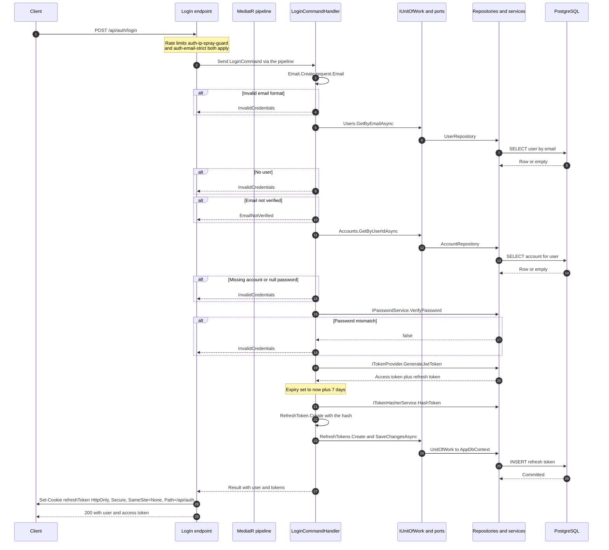
```mermaid
sequenceDiagram
    autonumber
    participant Client
    participant Endpoint as LogIn endpoint
    participant Pipeline as MediatR pipeline
    participant Handler as LoginCommandHandler
    participant Port as IUnitOfWork and ports
    participant Adapter as Repositories and services
    participant DB as PostgreSQL

    Client->>Endpoint: POST /api/auth/login
    Note over Endpoint: Rate limits auth-ip-spray-guard<br/>and auth-email-strict both apply
    Endpoint->>Handler: Send LoginCommand via the pipeline

    Handler->>Handler: Email.Create request.Email
    alt Invalid email format
        Handler-->>Endpoint: InvalidCredentials
    end

    Handler->>Port: Users.GetByEmailAsync
    Port->>Adapter: UserRepository
    Adapter->>DB: SELECT user by email
    DB-->>Adapter: Row or empty
    alt No user
        Handler-->>Endpoint: InvalidCredentials
    end
    alt Email not verified
        Handler-->>Endpoint: EmailNotVerified
    end

    Handler->>Port: Accounts.GetByUserIdAsync
    Port->>Adapter: AccountRepository
    Adapter->>DB: SELECT account for user
    DB-->>Adapter: Row or empty
    alt Missing account or null password
        Handler-->>Endpoint: InvalidCredentials
    end

    Handler->>Adapter: IPasswordService.VerifyPassword
    alt Password mismatch
        Adapter-->>Handler: false
        Handler-->>Endpoint: InvalidCredentials
    end

    Handler->>Adapter: ITokenProvider.GenerateJwtToken
    Adapter-->>Handler: Access token plus refresh token
    Note over Handler: Expiry set to now plus 7 days
    Handler->>Adapter: ITokenHasherService.HashToken
    Handler->>Handler: RefreshToken.Create with the hash
    Handler->>Port: RefreshTokens.Create and SaveChangesAsync
    Port->>Adapter: UnitOfWork to AppDbContext
    Adapter->>DB: INSERT refresh token
    DB-->>Adapter: Committed

    Handler-->>Endpoint: Result with user and tokens
    Endpoint->>Client: Set-Cookie refreshToken HttpOnly, Secure, SameSite=None, Path=/api/auth
    Endpoint-->>Client: 200 with user and access token
```

Every credential failure path returns the **same** `InvalidCredentials` error — unknown email, missing local account, and wrong password are indistinguishable to the caller. That is deliberate: it avoids confirming which emails are registered. The one exception is `EmailNotVerified`, which does reveal that the account exists, because the user needs to know to go and verify.

Login issues a **new** refresh token without revoking or rotating any existing one, so a user signing in from several devices accumulates one row per session in `identity.RefreshTokens`.

### 2.4 Google OAuth register

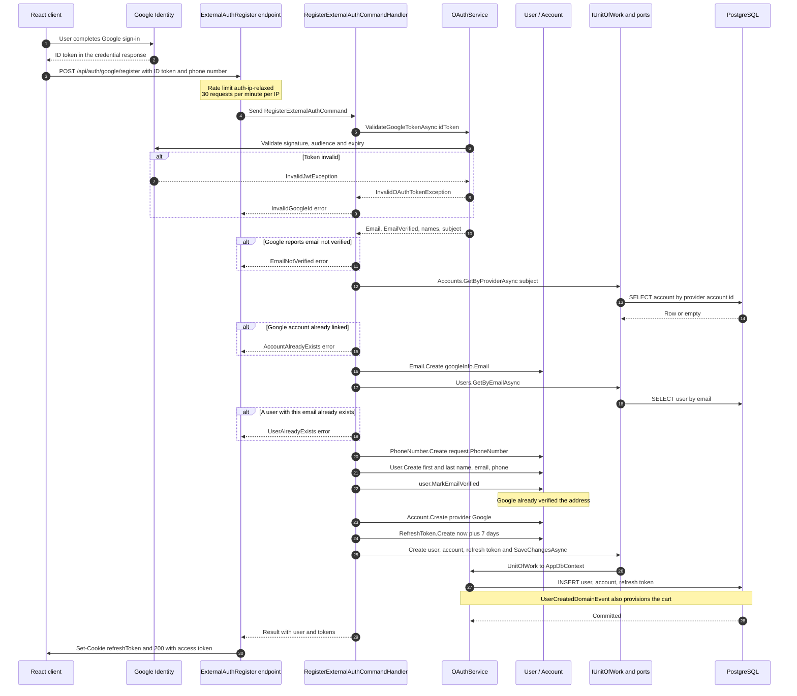
```mermaid
sequenceDiagram
    autonumber
    participant Client as React client
    participant Google as Google Identity
    participant Endpoint as ExternalAuthRegister endpoint
    participant Handler as RegisterExternalAuthCommandHandler
    participant Adapter as OAuthService
    participant Domain as User / Account
    participant Port as IUnitOfWork and ports
    participant DB as PostgreSQL

    Client->>Google: User completes Google sign-in
    Google-->>Client: ID token in the credential response
    Client->>Endpoint: POST /api/auth/google/register with ID token and phone number
    Note over Endpoint: Rate limit auth-ip-relaxed<br/>30 requests per minute per IP

    Endpoint->>Handler: Send RegisterExternalAuthCommand
    Handler->>Adapter: ValidateGoogleTokenAsync idToken
    Adapter->>Google: Validate signature, audience and expiry
    alt Token invalid
        Google-->>Adapter: InvalidJwtException
        Adapter-->>Handler: InvalidOAuthTokenException
        Handler-->>Endpoint: InvalidGoogleId error
    end
    Adapter-->>Handler: Email, EmailVerified, names, subject

    alt Google reports email not verified
        Handler-->>Endpoint: EmailNotVerified error
    end

    Handler->>Port: Accounts.GetByProviderAsync subject
    Port->>DB: SELECT account by provider account id
    DB-->>Port: Row or empty
    alt Google account already linked
        Handler-->>Endpoint: AccountAlreadyExists error
    end

    Handler->>Domain: Email.Create googleInfo.Email
    Handler->>Port: Users.GetByEmailAsync
    Port->>DB: SELECT user by email
    alt A user with this email already exists
        Handler-->>Endpoint: UserAlreadyExists error
    end

    Handler->>Domain: PhoneNumber.Create request.PhoneNumber
    Handler->>Domain: User.Create first and last name, email, phone
    Handler->>Domain: user.MarkEmailVerified
    Note over Domain: Google already verified the address
    Handler->>Domain: Account.Create provider Google
    Handler->>Domain: RefreshToken.Create now plus 7 days

    Handler->>Port: Create user, account, refresh token and SaveChangesAsync
    Port->>Adapter: UnitOfWork to AppDbContext
    Adapter->>DB: INSERT user, account, refresh token
    Note over Adapter,DB: UserCreatedDomainEvent also provisions the cart
    DB-->>Adapter: Committed

    Handler-->>Endpoint: Result with user and tokens
    Endpoint->>Client: Set-Cookie refreshToken and 200 with access token
```

The domain event path matters here: `User.Create` raises `UserCreatedDomainEvent`, so a Google user gets a shopping cart through exactly the same handler as a local user. Google registration is the only flow that sets `EmailVerified` at creation time, and it never creates a `VerificationToken`.

### 2.5 Google OAuth log in

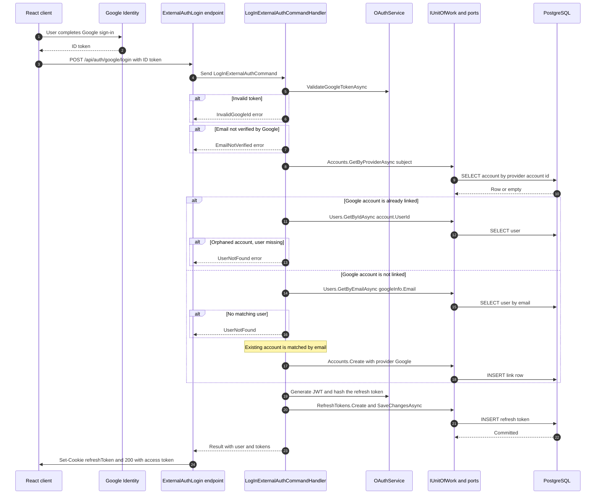
```mermaid
sequenceDiagram
    autonumber
    participant Client as React client
    participant Google as Google Identity
    participant Endpoint as ExternalAuthLogin endpoint
    participant Handler as LogInExternalAuthCommandHandler
    participant Adapter as OAuthService
    participant Port as IUnitOfWork and ports
    participant DB as PostgreSQL

    Client->>Google: User completes Google sign-in
    Google-->>Client: ID token
    Client->>Endpoint: POST /api/auth/google/login with ID token

    Endpoint->>Handler: Send LogInExternalAuthCommand
    Handler->>Adapter: ValidateGoogleTokenAsync
    alt Invalid token
        Handler-->>Endpoint: InvalidGoogleId error
    end
    alt Email not verified by Google
        Handler-->>Endpoint: EmailNotVerified error
    end

    Handler->>Port: Accounts.GetByProviderAsync subject
    Port->>DB: SELECT account by provider account id
    DB-->>Port: Row or empty

    alt Google account is already linked
        Handler->>Port: Users.GetByIdAsync account.UserId
        Port->>DB: SELECT user
        alt Orphaned account, user missing
            Handler-->>Endpoint: UserNotFound error
        end
    else Google account is not linked
        Handler->>Port: Users.GetByEmailAsync googleInfo.Email
        Port->>DB: SELECT user by email
        alt No matching user
            Handler-->>Endpoint: UserNotFound
        end
        Note over Handler: Existing account is matched by email
        Handler->>Port: Accounts.Create with provider Google
        Port->>DB: INSERT link row
    end

    Handler->>Adapter: Generate JWT and hash the refresh token
    Handler->>Port: RefreshTokens.Create and SaveChangesAsync
    Port->>DB: INSERT refresh token
    DB-->>Port: Committed

    Handler-->>Endpoint: Result with user and tokens
    Endpoint->>Client: Set-Cookie refreshToken and 200 with access token
```

Google login is also the **account-linking** path. When a Google identity is not yet linked but its verified email matches an existing local user, the handler creates a `Google` account row for that user and signs them in. Auto-linking trusts Google's `EmailVerified` claim, and `OAuthService` accepts the token only when its audience matches the configured `Authentication:Google:ClientId`.

### 2.6 Refresh the session

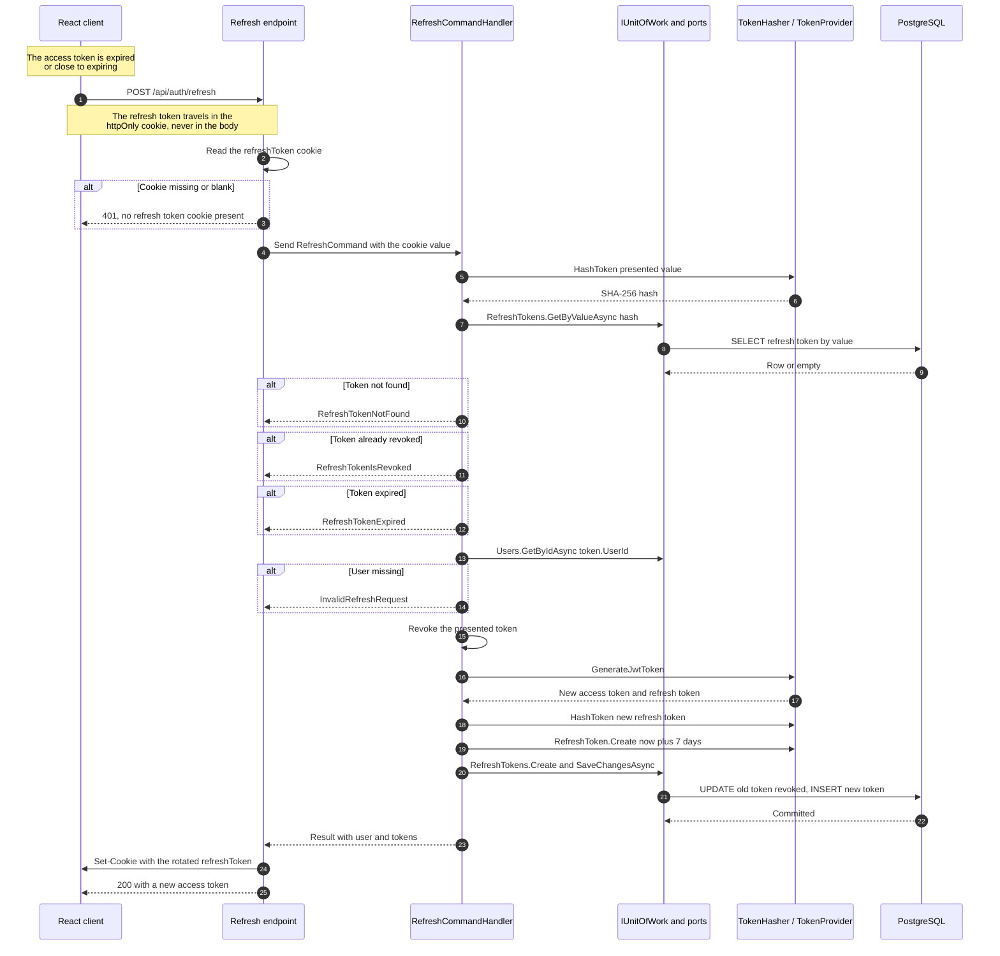
```mermaid
sequenceDiagram
    autonumber
    participant Client as React client
    participant Endpoint as Refresh endpoint
    participant Handler as RefreshCommandHandler
    participant Port as IUnitOfWork and ports
    participant Adapter as TokenHasher / TokenProvider
    participant DB as PostgreSQL

    Note over Client: The access token is expired<br/>or close to expiring
    Client->>Endpoint: POST /api/auth/refresh
    Note over Client,Endpoint: The refresh token travels in the<br/>httpOnly cookie, never in the body

    Endpoint->>Endpoint: Read the refreshToken cookie
    alt Cookie missing or blank
        Endpoint-->>Client: 401, no refresh token cookie present
    end

    Endpoint->>Handler: Send RefreshCommand with the cookie value
    Handler->>Adapter: HashToken presented value
    Adapter-->>Handler: SHA-256 hash
    Handler->>Port: RefreshTokens.GetByValueAsync hash
    Port->>DB: SELECT refresh token by value
    DB-->>Port: Row or empty

    alt Token not found
        Handler-->>Endpoint: RefreshTokenNotFound
    end
    alt Token already revoked
        Handler-->>Endpoint: RefreshTokenIsRevoked
    end
    alt Token expired
        Handler-->>Endpoint: RefreshTokenExpired
    end

    Handler->>Port: Users.GetByIdAsync token.UserId
    alt User missing
        Handler-->>Endpoint: InvalidRefreshRequest
    end

    Handler->>Handler: Revoke the presented token
    Handler->>Adapter: GenerateJwtToken
    Adapter-->>Handler: New access token and refresh token
    Handler->>Adapter: HashToken new refresh token
    Handler->>Adapter: RefreshToken.Create now plus 7 days

    Handler->>Port: RefreshTokens.Create and SaveChangesAsync
    Port->>DB: UPDATE old token revoked, INSERT new token
    DB-->>Port: Committed

    Handler-->>Endpoint: Result with user and tokens
    Endpoint->>Client: Set-Cookie with the rotated refreshToken
    Endpoint-->>Client: 200 with a new access token
```

Two properties make this flow safe to expose anonymously:

- **The cookie is the credential.** The endpoint takes no request body — it reads `refreshToken` from the cookie itself, so a caller cannot present an arbitrary token from a script on another origin. This is why `SameSite=None` plus HTTPS matters: the cookie must be sent on this cross-site request.
- **Rotation, not reuse.** The presented token is revoked and its replacement inserted in the same save, so each refresh token is valid exactly once. A stolen token that is used *after* the legitimate client rotated it fails with `RefreshTokenIsRevoked` — but note that the legitimate client's request would then succeed and the attacker's would fail, which is a detection opportunity the code does not currently log as a security event.

Unlike the login endpoints, `Refresh.cs` does **not** re-issue the access token through a `LoginResponse` difference — it returns the same shape, so the client can swap its in-memory token without any special casing.

### 2.7 Password reset (two steps)

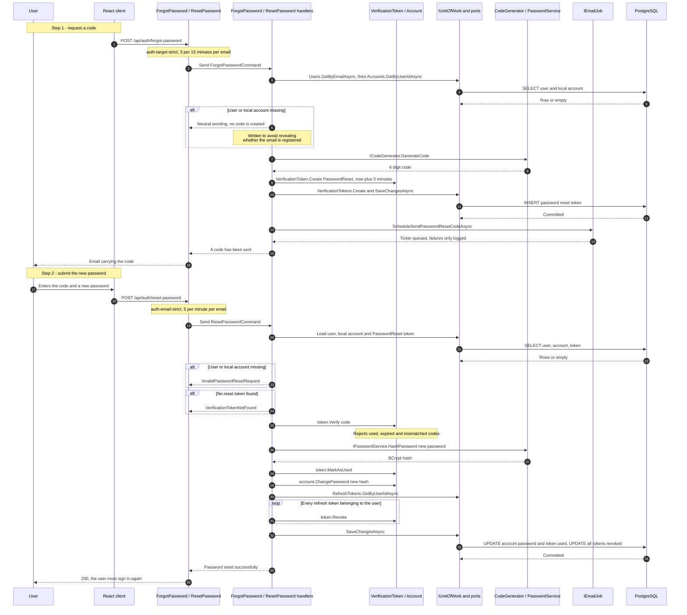
```mermaid
sequenceDiagram
    autonumber
    participant User
    participant Client as React client
    participant Endpoint as ForgotPassword / ResetPassword
    participant Handler as ForgotPassword / ResetPassword handlers
    participant Domain as VerificationToken / Account
    participant Port as IUnitOfWork and ports
    participant Adapter as CodeGenerator / PasswordService
    participant EmailJob as IEmailJob
    participant DB as PostgreSQL

    Note over User,Client: Step 1 - request a code
    Client->>Endpoint: POST /api/auth/forgot-password
    Note over Endpoint: auth-target-strict, 3 per 15 minutes per email
    Endpoint->>Handler: Send ForgotPasswordCommand
    Handler->>Port: Users.GetByEmailAsync, then Accounts.GetByUserIdAsync
    Port->>DB: SELECT user and local account
    DB-->>Port: Row or empty
    alt User or local account missing
        Handler-->>Endpoint: Neutral wording, no code is created
        Note over Handler: Written to avoid revealing<br/>whether the email is registered
    end

    Handler->>Adapter: ICodeGenerator.GenerateCode
    Adapter-->>Handler: 6 digit code
    Handler->>Domain: VerificationToken.Create PasswordReset, now plus 5 minutes
    Handler->>Port: VerificationTokens.Create and SaveChangesAsync
    Port->>DB: INSERT password reset token
    DB-->>Port: Committed
    Handler->>EmailJob: ScheduleSendPasswordResetCodeAsync
    EmailJob-->>Handler: Ticker queued, failures only logged
    Handler-->>Endpoint: A code has been sent
    Endpoint-->>User: Email carrying the code

    Note over User,Client: Step 2 - submit the new password
    User->>Client: Enters the code and a new password
    Client->>Endpoint: POST /api/auth/reset-password
    Note over Endpoint: auth-email-strict, 5 per minute per email
    Endpoint->>Handler: Send ResetPasswordCommand
    Handler->>Port: Load user, local account and PasswordReset token
    Port->>DB: SELECT user, account, token
    DB-->>Port: Rows or empty
    alt User or local account missing
        Handler-->>Endpoint: InvalidPasswordResetRequest
    end
    alt No reset token found
        Handler-->>Endpoint: VerificationTokenNotFound
    end

    Handler->>Domain: token.Verify code
    Note over Domain: Rejects used, expired and mismatched codes
    Handler->>Adapter: IPasswordService.HashPassword new password
    Adapter-->>Handler: BCrypt hash
    Handler->>Domain: token.MarkAsUsed
    Handler->>Domain: account.ChangePassword new hash

    Handler->>Port: RefreshTokens.GetByUserIdAsync
    loop Every refresh token belonging to the user
        Handler->>Domain: token.Revoke
    end

    Handler->>Port: SaveChangesAsync
    Port->>DB: UPDATE account password and token used, UPDATE all tokens revoked
    DB-->>Port: Committed
    Handler-->>Endpoint: Password reset successfully
    Endpoint-->>User: 200, the user must sign in again
```

Three things are worth stating plainly about this flow:

- **Every session is invalidated.** The handler loads all of the user's refresh tokens and revokes each one, so a password reset signs the account out of every device. If a password was reset because it was compromised, the attacker's existing sessions die with it.
- **No new session is issued.** Unlike `verify-email`, this flow deliberately returns only a message, so the user signs in again with the new password. That is the safer default after a credential change.
- **⚠️ The response body still discloses whether an account exists.** The neutral string is returned when the user or the local account is missing — but the success path returns a *different, longer* message ("A verification code has been sent to your email address..."). Because the two bodies differ, a caller can distinguish a registered email from an unregistered one by reading the response text, which defeats the purpose of the neutral branch. The rate limiter softens but does not remove this: `auth-target-strict` allows 3 probes per 15 minutes per address, which is plenty for enumeration. This is the one place in the authentication surface where the implementation does not match its own stated intent.

### 2.8 Code resend and logout

These two endpoints complete the authentication surface and share a theme: both are deliberately written to give away as little as possible.

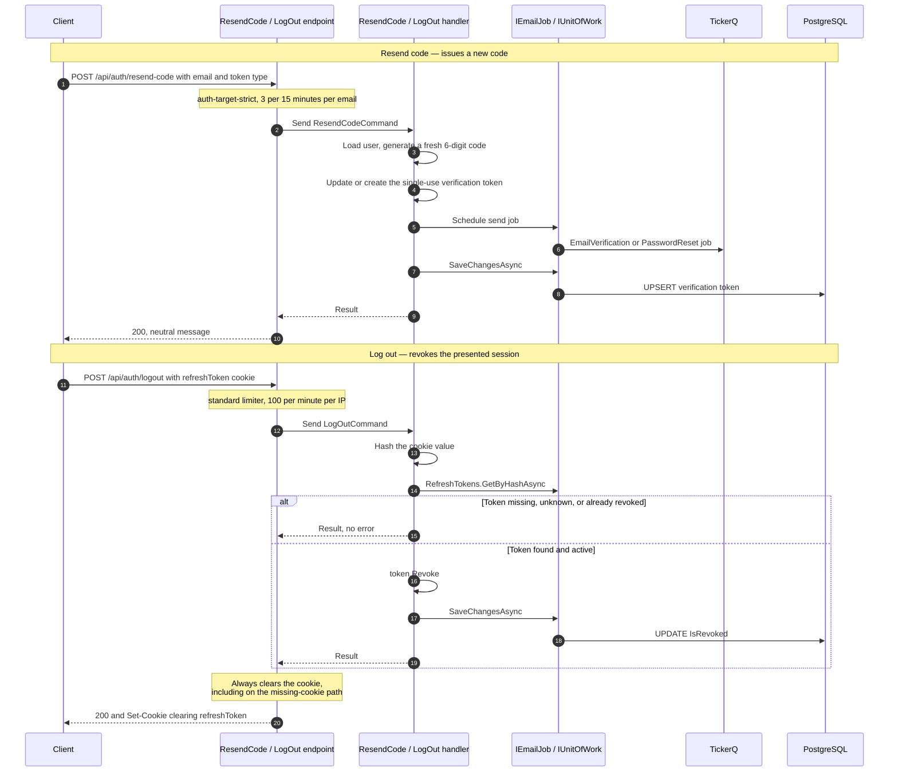
```mermaid
sequenceDiagram
    autonumber
    participant Client
    participant Endpoint as ResendCode / LogOut endpoint
    participant Handler as ResendCode / LogOut handler
    participant Port as IEmailJob / IUnitOfWork
    participant Ticker as TickerQ
    participant DB as PostgreSQL

    Note over Client,DB: Resend code — issues a new code
    Client->>Endpoint: POST /api/auth/resend-code with email and token type
    Note over Endpoint: auth-target-strict, 3 per 15 minutes per email
    Endpoint->>Handler: Send ResendCodeCommand
    Handler->>Handler: Load user, generate a fresh 6-digit code
    Handler->>Handler: Update or create the single-use verification token
    Handler->>Port: Schedule send job
    Port->>Ticker: EmailVerification or PasswordReset job
    Handler->>Port: SaveChangesAsync
    Port->>DB: UPSERT verification token
    Handler-->>Endpoint: Result
    Endpoint-->>Client: 200, neutral message


    Note over Client,DB: Log out — revokes the presented session
    Client->>Endpoint: POST /api/auth/logout with refreshToken cookie
    Note over Endpoint: standard limiter, 100 per minute per IP
    Endpoint->>Handler: Send LogOutCommand
    Handler->>Handler: Hash the cookie value
    Handler->>Port: RefreshTokens.GetByHashAsync
    alt Token missing, unknown, or already revoked
        Handler-->>Endpoint: Result, no error
    else Token found and active
        Handler->>Handler: token.Revoke
        Handler->>Port: SaveChangesAsync
        Port->>DB: UPDATE IsRevoked
        Handler-->>Endpoint: Result
    end
    Note over Endpoint: Always clears the cookie,<br/>including on the missing-cookie path
    Endpoint-->>Client: 200 and Set-Cookie clearing refreshToken
```

| Flow | What the handler does | Why it is shaped that way |
| --- | --- | --- |
| Resend code (`ResendCode.cs`) | Loads the user, generates a fresh code, updates or creates the verification token, then schedules the matching email — `SendVerificationCode` for `EmailVerification` and `SendPasswordResetCode` for `PasswordReset` | One endpoint serves both purposes, so it branches on the requested token type rather than duplicating the flow. Guarded by `auth-target-strict` because it is a code-generation endpoint |
| Log out (`LogOut.cs`) | Hashes the `refreshToken` cookie, looks the row up, and revokes it. If the cookie is absent, it clears the cookie and returns success; if the token is already revoked or unknown, it also returns success | Returning an error for an unknown token would let a caller test whether a token is valid. The endpoint always clears the cookie, including on the missing-cookie path, so the client never keeps a token the server has decided to forget |

The deliberate difference between the two revocation flows is worth remembering:

- **Logout revokes one token** — the session that presented the cookie. Other devices stay signed in.
- **Password reset revokes every token** for the user. Every device is signed out.

### 2.9 Session rules across all flows

| Rule | Value |
| --- | --- |
| Access-token lifetime | `JwtSettings.TokenExpirationInMinutes`, configured as 15 minutes |
| Access-token transport | Response body only; the client keeps it in memory |
| JWT claims | `NameIdentifier` (user id), `Email`, `Role` |
| Refresh-token lifetime | 7 days, applied by the handlers |
| Refresh-token storage | SHA-256 hash in `identity.RefreshTokens` |
| Cookie flags | `HttpOnly`, `Secure`, `SameSite=None`, `Path=/api/auth`, explicit `Expires` |

### 2.10 Known limitations

- **Google failures all map to `400`.** Invalid token, unverified email, and already-linked account are not distinguishable by status code, so the client cannot tell "retry" from "stop".
- **`SameSite=None` requires HTTPS.** The cookie only works because both sides are served over HTTPS here. Over plain HTTP the browser drops it and refresh silently fails.
- **No refresh-token revocation on new login.** Sessions accumulate one row per sign-in; nothing prunes expired rows.
- **`VerifyEmail` omits the cookie.** It returns a refresh token in the body that the client has no cookie for.
- **The cart reaction can fail independently.** The `UserCreatedDomainEvent` handler saves separately, so the inter-event atomicity trade-off recorded in [`Architecture.md`](Architecture.md) applies to both registration paths.
- **Password reset leaks account existence.** The neutral message written for unknown emails is not the message a known email receives, so the response body distinguishes the two cases. See section 2.7.
- **The refresh token cannot be reused, but the failure is not treated as a security event.** A rotated token presented again returns `RefreshTokenIsRevoked` and is logged as a warning; nothing correlates that with the user's live sessions the way token-reuse detection normally would.

---

## 3. Purchase and Payment Workflows

Three workflows make up the checkout lifecycle: **creating** a purchase and its gateway checkout, **confirming** it through the payment webhook, and **retrying** a payment that failed.

| Flow | Endpoint | Route | Authorization | Rate limiting |
| --- | --- | --- | --- | --- |
| Create purchase | `CreatePurchase.cs` | `POST /api/purchases` | Roles `Admin`, `Customer` | `purchase-strict` — 10 / min / user |
| Payment webhook | `PaymentWebhook.cs` | `POST /api/purchases/webhook/payment` | Anonymous, signature validated | none |
| Retry payment | `RetryPurchase.cs` | `POST /api/purchases/retry/{purchaseId:guid}` | Roles `Admin`, `Customer` | `purchase-strict` — 10 / min / user |

### 3.1 Create purchase and open a checkout

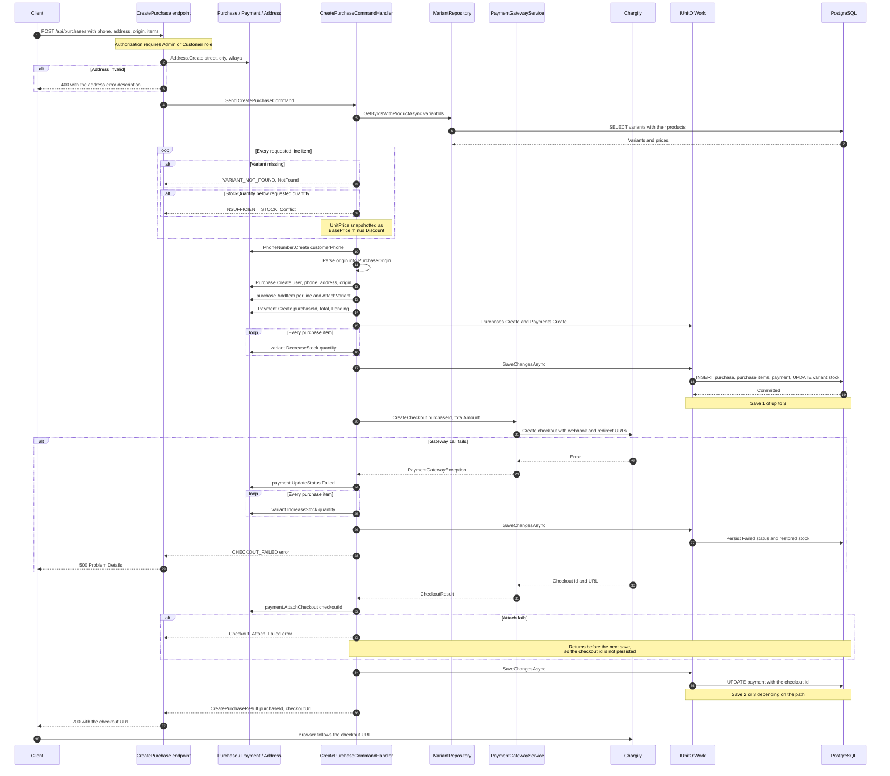
```mermaid
sequenceDiagram
    autonumber
    participant Client
    participant Endpoint as CreatePurchase endpoint
    participant Domain as Purchase / Payment / Address
    participant Handler as CreatePurchaseCommandHandler
    participant VariantRepo as IVariantRepository
    participant Gateway as IPaymentGatewayService
    participant Chargily
    participant Port as IUnitOfWork
    participant DB as PostgreSQL

    Client->>Endpoint: POST /api/purchases with phone, address, origin, items
    Note over Endpoint: Authorization requires Admin or Customer role
    Endpoint->>Domain: Address.Create street, city, wilaya
    alt Address invalid
        Endpoint-->>Client: 400 with the address error description
    end
    Endpoint->>Handler: Send CreatePurchaseCommand

    Handler->>VariantRepo: GetByIdsWithProductAsync variantIds
    VariantRepo->>DB: SELECT variants with their products
    DB-->>VariantRepo: Variants and prices
    loop Every requested line item
        alt Variant missing
            Handler-->>Endpoint: VARIANT_NOT_FOUND, NotFound
        end
        alt StockQuantity below requested quantity
            Handler-->>Endpoint: INSUFFICIENT_STOCK, Conflict
        end
        Note over Handler: UnitPrice snapshotted as<br/>BasePrice minus Discount
    end

    Handler->>Domain: PhoneNumber.Create customerPhone
    Handler->>Handler: Parse origin into PurchaseOrigin
    Handler->>Domain: Purchase.Create user, phone, address, origin
    Handler->>Domain: purchase.AddItem per line and AttachVariant
    Handler->>Domain: Payment.Create purchaseId, total, Pending
    Handler->>Port: Purchases.Create and Payments.Create

    loop Every purchase item
        Handler->>Domain: variant.DecreaseStock quantity
    end

    Handler->>Port: SaveChangesAsync
    Port->>DB: INSERT purchase, purchase items, payment, UPDATE variant stock
    DB-->>Port: Committed
    Note over Port,DB: Save 1 of up to 3

    Handler->>Gateway: CreateCheckout purchaseId, totalAmount
    Gateway->>Chargily: Create checkout with webhook and redirect URLs
    alt Gateway call fails
        Chargily-->>Gateway: Error
        Gateway-->>Handler: PaymentGatewayException
        Handler->>Domain: payment.UpdateStatus Failed
        loop Every purchase item
            Handler->>Domain: variant.IncreaseStock quantity
        end
        Handler->>Port: SaveChangesAsync
        Port->>DB: Persist Failed status and restored stock
        Handler-->>Endpoint: CHECKOUT_FAILED error
        Endpoint-->>Client: 500 Problem Details
    end
    Chargily-->>Gateway: Checkout id and URL
    Gateway-->>Handler: CheckoutResult

    Handler->>Domain: payment.AttachCheckout checkoutId
    alt Attach fails
        Handler-->>Endpoint: Checkout_Attach_Failed error
        Note over Handler,DB: Returns before the next save,<br/>so the checkout id is not persisted
    end

    Handler->>Port: SaveChangesAsync
    Port->>DB: UPDATE payment with the checkout id
    Note over Port,DB: Save 2 or 3 depending on the path

    Handler-->>Endpoint: CreatePurchaseResult purchaseId, checkoutUrl
    Endpoint-->>Client: 200 with the checkout URL
    Client->>Chargily: Browser follows the checkout URL
```

The order of operations is deliberate: **inventory and money state are committed before the external call**, so a slow gateway cannot hold a database transaction open. The cost is described in [`Architecture.md`](Architecture.md): a crash between the first save and `AttachCheckout` leaves a `Pending` purchase with reduced stock and no checkout id, and nothing in this flow recovers that state.

After `Payment.Create`, `Purchase` exposes `Origin`, which the webhook later uses to decide whether the cart should be cleared:

- `PurchaseOrigin.Cart` — the buyer checked out from the cart, so a paid payment clears it.
- `PurchaseOrigin.BuyNow` — the buyer bought directly, so there is no cart to clear.

### 3.2 Payment confirmation (webhook)

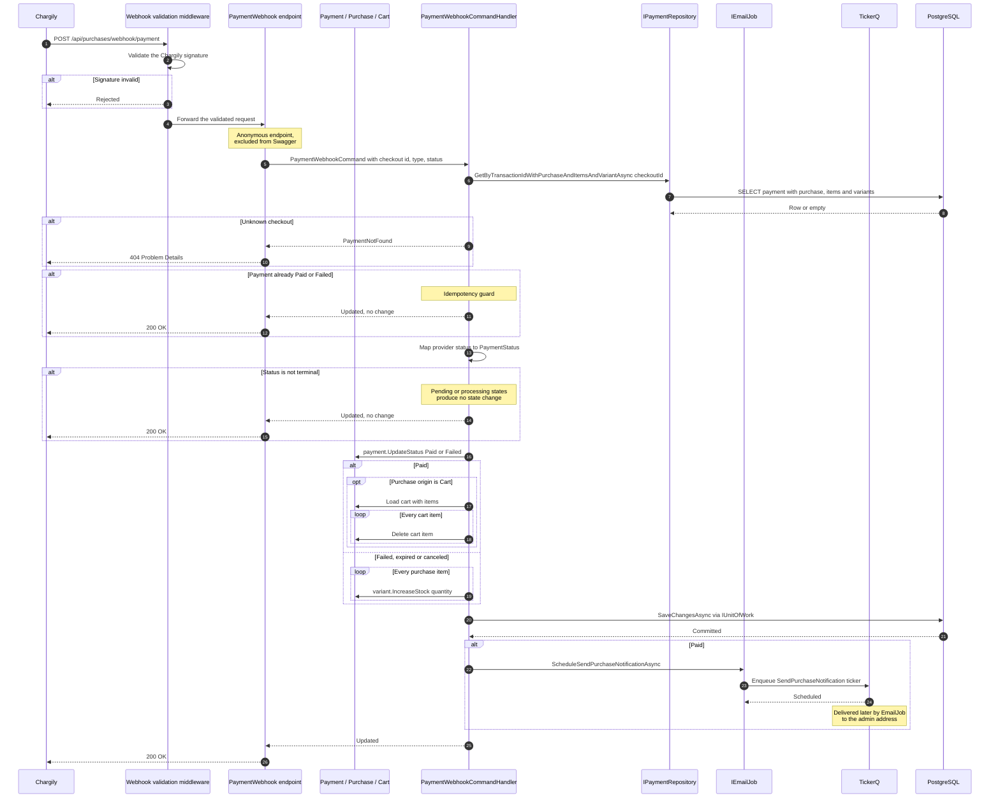
```mermaid
sequenceDiagram
    autonumber
    participant Chargily
    participant Middleware as Webhook validation middleware
    participant Endpoint as PaymentWebhook endpoint
    participant Domain as Payment / Purchase / Cart
    participant Handler as PaymentWebhookCommandHandler
    participant PaymentRepo as IPaymentRepository
    participant EmailJob as IEmailJob
    participant Ticker as TickerQ
    participant DB as PostgreSQL

    Chargily->>Middleware: POST /api/purchases/webhook/payment
    Middleware->>Middleware: Validate the Chargily signature
    alt Signature invalid
        Middleware-->>Chargily: Rejected
    end
    Middleware->>Endpoint: Forward the validated request
    Note over Endpoint: Anonymous endpoint,<br/>excluded from Swagger
    Endpoint->>Handler: PaymentWebhookCommand with checkout id, type, status

    Handler->>PaymentRepo: GetByTransactionIdWithPurchaseAndItemsAndVariantAsync checkoutId
    PaymentRepo->>DB: SELECT payment with purchase, items and variants
    DB-->>PaymentRepo: Row or empty
    alt Unknown checkout
        Handler-->>Endpoint: PaymentNotFound
        Endpoint-->>Chargily: 404 Problem Details
    end

    alt Payment already Paid or Failed
        Note over Handler: Idempotency guard
        Handler-->>Endpoint: Updated, no change
        Endpoint-->>Chargily: 200 OK
    end

    Handler->>Handler: Map provider status to PaymentStatus
    alt Status is not terminal
        Note over Handler: Pending or processing states<br/>produce no state change
        Handler-->>Endpoint: Updated, no change
        Endpoint-->>Chargily: 200 OK
    end

    Handler->>Domain: payment.UpdateStatus Paid or Failed

    alt Paid
        opt Purchase origin is Cart
            Handler->>Domain: Load cart with items
            loop Every cart item
                Handler->>Domain: Delete cart item
            end
        end
    else Failed, expired or canceled
        loop Every purchase item
            Handler->>Domain: variant.IncreaseStock quantity
        end
    end

    Handler->>DB: SaveChangesAsync via IUnitOfWork
    DB-->>Handler: Committed

    alt Paid
        Handler->>EmailJob: ScheduleSendPurchaseNotificationAsync
        EmailJob->>Ticker: Enqueue SendPurchaseNotification ticker
        Ticker-->>EmailJob: Scheduled
        Note over Ticker: Delivered later by EmailJob<br/>to the admin address
    end

    Handler-->>Endpoint: Updated
    Endpoint-->>Chargily: 200 OK
```

This endpoint is the only place where stock is restored for a **failed** payment during a normal checkout, and the only place where the cart is emptied after a **paid** one. Terminal provider states are `paid`, `failed`, `expired`, and `canceled`; anything else is treated as non-terminal and ignored, which prevents intermediate states from mutating the order.

### 3.3 Retry a failed payment

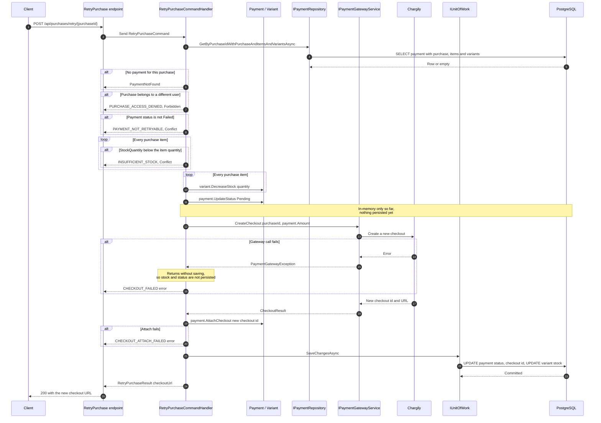
```mermaid
sequenceDiagram
    autonumber
    participant Client
    participant Endpoint as RetryPurchase endpoint
    participant Handler as RetryPurchaseCommandHandler
    participant Domain as Payment / Variant
    participant PaymentRepo as IPaymentRepository
    participant Gateway as IPaymentGatewayService
    participant Chargily
    participant Port as IUnitOfWork
    participant DB as PostgreSQL

    Client->>Endpoint: POST /api/purchases/retry/{purchaseId}
    Endpoint->>Handler: Send RetryPurchaseCommand

    Handler->>PaymentRepo: GetByPurchaseIdWithPurchaseAndItemsAndVariantsAsync
    PaymentRepo->>DB: SELECT payment with purchase, items and variants
    DB-->>PaymentRepo: Row or empty
    alt No payment for this purchase
        Handler-->>Endpoint: PaymentNotFound
    end

    alt Purchase belongs to a different user
        Handler-->>Endpoint: PURCHASE_ACCESS_DENIED, Forbidden
    end

    alt Payment status is not Failed
        Handler-->>Endpoint: PAYMENT_NOT_RETRYABLE, Conflict
    end

    loop Every purchase item
        alt StockQuantity below the item quantity
            Handler-->>Endpoint: INSUFFICIENT_STOCK, Conflict
        end
    end

    loop Every purchase item
        Handler->>Domain: variant.DecreaseStock quantity
    end
    Handler->>Domain: payment.UpdateStatus Pending
    Note over Handler,DB: In-memory only so far,<br/>nothing persisted yet

    Handler->>Gateway: CreateCheckout purchaseId, payment.Amount
    Gateway->>Chargily: Create a new checkout
    alt Gateway call fails
        Chargily-->>Gateway: Error
        Gateway-->>Handler: PaymentGatewayException
        Note over Handler: Returns without saving,<br/>so stock and status are not persisted
        Handler-->>Endpoint: CHECKOUT_FAILED error
    end
    Chargily-->>Gateway: New checkout id and URL
    Gateway-->>Handler: CheckoutResult

    Handler->>Domain: payment.AttachCheckout new checkout id
    alt Attach fails
        Handler-->>Endpoint: CHECKOUT_ATTACH_FAILED error
    end

    Handler->>Port: SaveChangesAsync
    Port->>DB: UPDATE payment status, checkout id, UPDATE variant stock
    DB-->>Port: Committed

    Handler-->>Endpoint: RetryPurchaseResult checkoutUrl
    Endpoint-->>Client: 200 with the new checkout URL
```

Retry **reuses** the existing purchase and payment. It does not create a new order. Two properties are worth noting:

- **Ownership is enforced in the handler, not by a policy.** The check is `payment.Purchase.UserId != _currentUser.UserId`, and it returns a `Forbidden` error. The `Admin` role can therefore only retry its own purchases, not any customer's.
- **A gateway failure is clean.** Stock is decremented and the status is set to `Pending` in memory, but because `SaveChangesAsync` happens *after* the gateway call, a `PaymentGatewayException` returns before anything is written. Nothing needs to be compensated.

### 3.4 Payment status transitions

`PaymentStatus` and `Payment.UpdateStatus` enforce which transitions are legal, so the workflow above cannot move a payment into an arbitrary state.

| From | To | Triggered by | Meaning |
| --- | --- | --- | --- |
| — | `Pending` | `CreatePurchaseCommandHandler` | Payment record created before the gateway call |
| `Pending` | `Paid` | Webhook, provider status `paid` | Checkout confirmed; cart cleared when origin is `Cart` |
| `Pending` | `Failed` | Webhook, provider status `failed` / `expired` / `canceled` | Stock restored for every purchase item |
| `Pending` | `Failed` | `CreatePurchaseCommandHandler` | Gateway could not create a checkout; stock restored |
| `Failed` | `Pending` | `RetryPurchaseCommandHandler` | A new checkout is opened and stock is reserved again |
| `Failed` | `Paid` | Webhook on the **new** checkout | Retry succeeded |
| any | `Refunded` | nothing in this codebase | Reserved in the schema and enum; there is no refund flow |

Two consequences follow from this table:

- **`Paid` and `Failed` are terminal for the idempotency guard.** Once a payment is `Failed`, a later event for the *same* checkout id is ignored. Retry works around this by attaching a **new** checkout id, which is why `TransactionId` stays unique per attempt rather than per purchase.
- **`Refunded` is unreachable.** The enum value and the database check constraint allow it, but no handler sets it. See [`Database-Design.md`](Database-Design.md) for the schema-side note.

### 3.5 Known limitations

- **Checkout creation is not atomic with the purchase.** The purchase, items, payment, and stock reduction are committed before the handler calls `IPaymentGatewayService.CreateCheckout`, which is the only external call in the flow. A crash between the first save and `AttachCheckout` leaves a `Pending` purchase with reduced stock and no checkout id, and `RetryPurchase` will not accept it because it requires `Failed`. This is the trade-off recorded in [`Architecture.md`](Architecture.md).
- **No inbound reconciliation.** There is no job that polls Chargily for checkouts that stayed `Pending` past their expiry, so a webhook that never arrives leaves stock reserved indefinitely.
- **`INSUFFICIENT_STOCK` is checked twice but not reserved.** Create purchase and retry both compare `StockQuantity` to the requested quantity, then decrement. Two concurrent checkouts for the same variant can both pass the check; only the database-level non-negative constraint would surface the problem afterwards.
- **The webhook has no rate limit.** It is anonymous and relies entirely on the Chargily signature middleware. That is the correct trust model, but a flood of invalid-signature requests is only stopped after middleware validation runs.
- **Retry allows `Admin` but not another customer's order.** Ownership is enforced in the handler by user id rather than by an authorization policy, so the `Admin` role does not grant cross-customer retry.
- **The same failure carries two different error codes.** Create purchase returns `Checkout_Attach_Failed` (`CreatePurchaseCommandHandler.cs:168`), while retry returns `CHECKOUT_ATTACH_FAILED` (`RetryPurchaseCommandHandler.cs:125`) for the identical condition. This is a genuine inconsistency in the source, not a transcription slip in this document — both spellings are the real literals. Every other payment error here is SCREAMING_SNAKE_CASE, so these two are the exception, and because they are distinct strings a client matching on the code has to handle both. The diagrams in 3.1 and 3.3 reproduce each handler's literal value rather than normalising them, because that is what goes over the wire. Fixing it is a one-line change in `CreatePurchaseCommandHandler`, but it is a breaking change for any client already matching the current code, so it is recorded here rather than made.

---

## 4. Payment End-to-End (External View)

Sections 1 to 3 zoom into the backend. The two diagrams below zoom **out** and show only the parties a payment actually involves: the **React client**, the **.NET backend**, and **Chargily** — plus the person paying. Internal layers, repositories, and database tables are collapsed into the backend column on purpose, so this section reads as the story a user experiences.

### 4.1 Purchase — opening a checkout

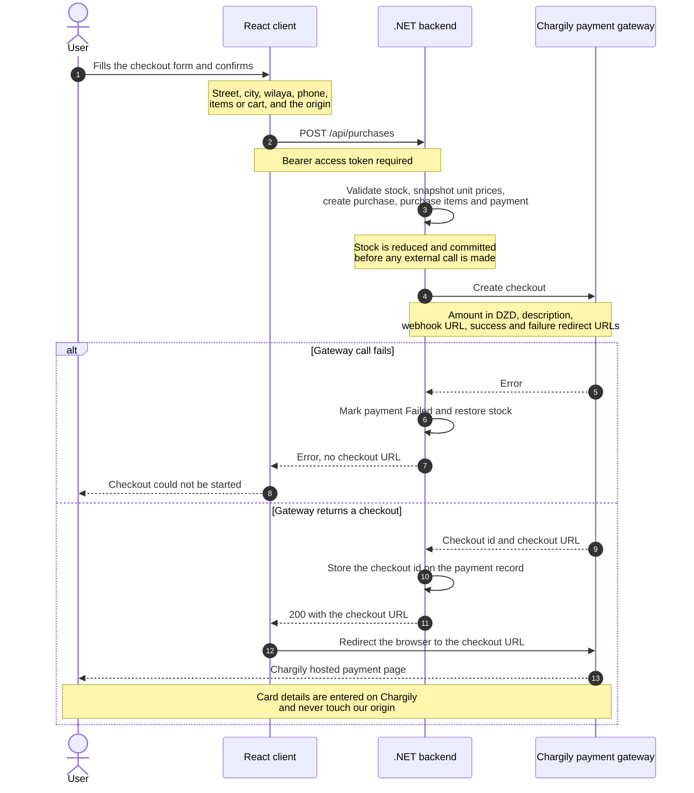
```mermaid
sequenceDiagram
    autonumber
    actor User
    participant Client as React client
    participant Backend as .NET backend
    participant Chargily as Chargily payment gateway

    User->>Client: Fills the checkout form and confirms
    Note over Client: Street, city, wilaya, phone,<br/>items or cart, and the origin
    Client->>Backend: POST /api/purchases
    Note over Client,Backend: Bearer access token required

    Backend->>Backend: Validate stock, snapshot unit prices,<br/>create purchase, purchase items and payment
    Note over Backend: Stock is reduced and committed<br/>before any external call is made

    Backend->>Chargily: Create checkout
    Note over Backend,Chargily: Amount in DZD, description,<br/>webhook URL, success and failure redirect URLs

    alt Gateway call fails
        Chargily-->>Backend: Error
        Backend->>Backend: Mark payment Failed and restore stock
        Backend-->>Client: Error, no checkout URL
        Client-->>User: Checkout could not be started
    else Gateway returns a checkout
        Chargily-->>Backend: Checkout id and checkout URL
        Backend->>Backend: Store the checkout id on the payment record
        Backend-->>Client: 200 with the checkout URL
        Client->>Chargily: Redirect the browser to the checkout URL
        Chargily-->>User: Chargily hosted payment page
        Note over User,Chargily: Card details are entered on Chargily<br/>and never touch our origin
    end
```

The important property here is **card data never reaches our servers**. The backend sends only an amount, a description, and a purchase reference; it receives back a checkout id and a URL. The hosted page, and everything the customer types into it, belong to Chargily.

The backend keeps working after handing over the URL: the stored checkout id is the key that lets the webhook in section 4.2 find the right payment record.

### 4.2 Payment — confirming a payment

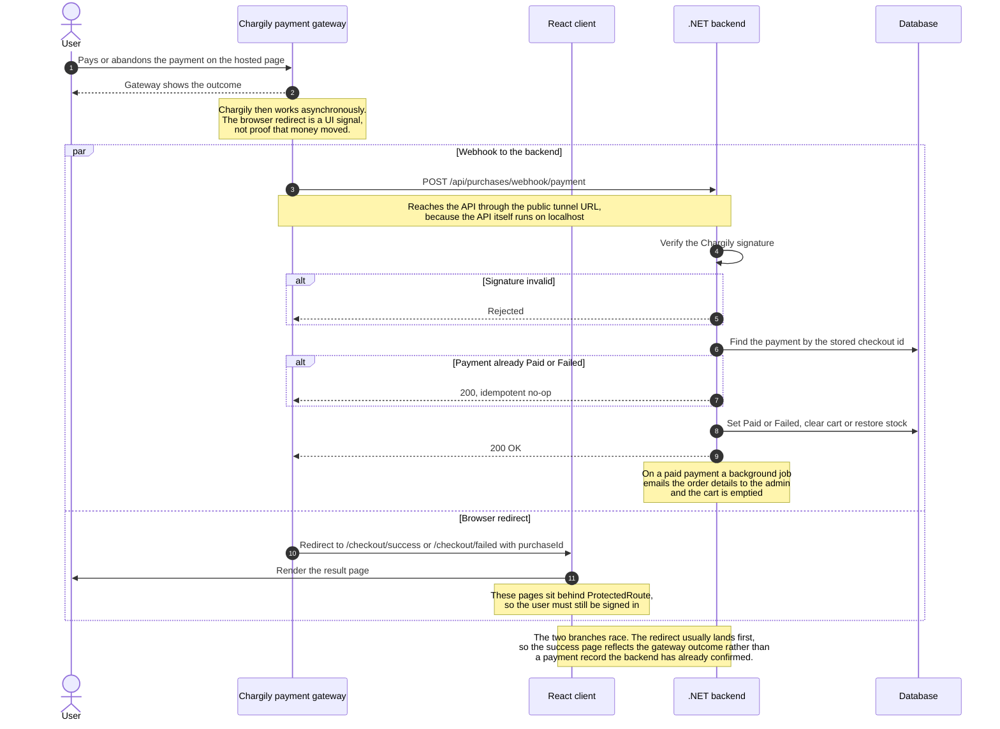
```mermaid
sequenceDiagram
    autonumber
    actor User
    participant Chargily as Chargily payment gateway
    participant Client as React client
    participant Backend as .NET backend
    participant DB as Database

    User->>Chargily: Pays or abandons the payment on the hosted page
    Chargily-->>User: Gateway shows the outcome

    Note over Chargily: Chargily then works asynchronously.<br/>The browser redirect is a UI signal,<br/>not proof that money moved.

    par Webhook to the backend
        Chargily->>Backend: POST /api/purchases/webhook/payment
        Note over Chargily,Backend: Reaches the API through the public tunnel URL,<br/>because the API itself runs on localhost
        Backend->>Backend: Verify the Chargily signature
        alt Signature invalid
            Backend-->>Chargily: Rejected
        end
        Backend->>DB: Find the payment by the stored checkout id
        alt Payment already Paid or Failed
            Backend-->>Chargily: 200, idempotent no-op
        end
        Backend->>DB: Set Paid or Failed, clear cart or restore stock
        Backend-->>Chargily: 200 OK
        Note over Backend: On a paid payment a background job<br/>emails the order details to the admin<br/>and the cart is emptied
    and Browser redirect
        Chargily->>Client: Redirect to /checkout/success or /checkout/failed with purchaseId
        Client->>User: Render the result page
        Note over Client: These pages sit behind ProtectedRoute,<br/>so the user must still be signed in
    end

    Note over Client,Backend: The two branches race. The redirect usually lands first,<br/>so the success page reflects the gateway outcome rather than<br/>a payment record the backend has already confirmed.
```

**Outcome mapping**

| Chargily status | Stored `PaymentStatus` | Stock | Cart | User lands on |
| --- | --- | --- | --- | --- |
| `paid` | `Paid` | stays reduced | cleared when origin is `Cart` | `/checkout/success?purchaseId=...` |
| `failed` / `expired` / `canceled` | `Failed` | restored for every item | untouched | `/checkout/failed?purchaseId=...` |
| `pending` / `processing` | unchanged | unchanged | unchanged | stays on the gateway page |
| — (gateway never reached) | `Failed` | restored by the create-purchase handler | untouched | `/checkout/failed`, but opened by the client, not by a redirect |

Two operational facts behind these diagrams:

- **The webhook needs a public URL.** `Chargily:WebhookEndpointUrl` points at an ngrok tunnel in front of the local API, which is why the tunnel must be running for a payment to ever be confirmed. The redirect URLs point back at `https://localhost:5173`, so the browser flows through the local dev server while the webhook flows through the tunnel.
- **A missing webhook is not self-healing.** If the callback never arrives, the purchase stays `Pending` and the stock stays reserved; there is no reconciliation job that polls the gateway. This is the same gap recorded in section 3.5.

---

## Summary

| Concern | Entry point | Key mechanism |
| --- | --- | --- |
| Background jobs | `POST` handlers that schedule through `IEmailJob` / `IImageCleanupJob` | TickerQ functions with an immediate `ExecutionTime`, heartbeats exposed through `/health` |
| Registration | `POST /api/auth/register` | Value objects, BCrypt hash, 6-digit code valid 5 minutes, cart created by a domain event |
| Email verification | `POST /api/auth/verify-email` | Single-use token, marks the user verified, issues the first session |
| Local login | `POST /api/auth/login` | Identical error for every credential failure, refresh token stored as a hash |
| Google register | `POST /api/auth/google/register` | Validated ID token, email pre-verified, Google account row linked |
| Google login | `POST /api/auth/google/login` | Auto-links a verified Google email to an existing user |
| Session refresh | `POST /api/auth/refresh` | Hash lookup, then revoke-and-rotate: the presented token is revoked and a new pair issued |
| Forgot password | `POST /api/auth/forgot-password` | Generates a 6-digit reset code and schedules the email; guarded by `auth-target-strict` |
| Password reset | `POST /api/auth/reset-password` | Consumes the code, re-hashes the password, and revokes **every** refresh token for that user |
| Code resend | `POST /api/auth/resend-code` | One endpoint for both token types; issues a fresh code and schedules the matching email |
| Logout | `POST /api/auth/logout` | Revokes only the presented token, always clears the cookie, never errors on an unknown token |
| Purchase creation | `POST /api/purchases` | Prices snapshotted, stock reduced, then a Chargily checkout is opened |
| Payment confirmation | `POST /api/purchases/webhook/payment` | Signature-validated, idempotent, clears the cart or restores stock |
| Payment retry | `POST /api/purchases/retry/{purchaseId}` | Reuses the purchase, requires `Failed`, re-reserves stock, opens a new checkout |

Every flow above shares one structural habit: **the handler orchestrates, the domain decides, and infrastructure performs I/O**. Where that habit costs something — pre-write domain events, separate saves, swallowed job failures, unreachable `Refunded` — the cost is recorded in this document and cross-referenced to [`Architecture.md`](Architecture.md) rather than left implicit.

The table lists all **thirteen** documented flows: one background-job concern, all ten endpoints in the `AuthGroup`, and the three payment workflows. Section 4 is the checkout lifecycle from the outside. Read section 3 to understand how the backend implements a payment, and section 4 to understand what the customer, the browser, and Chargily actually experience.

