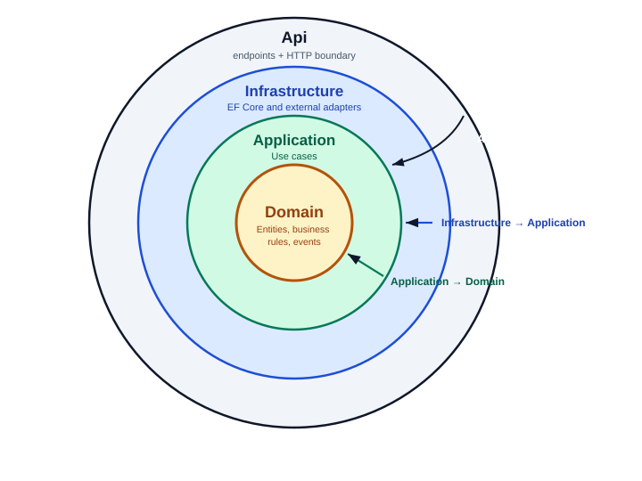
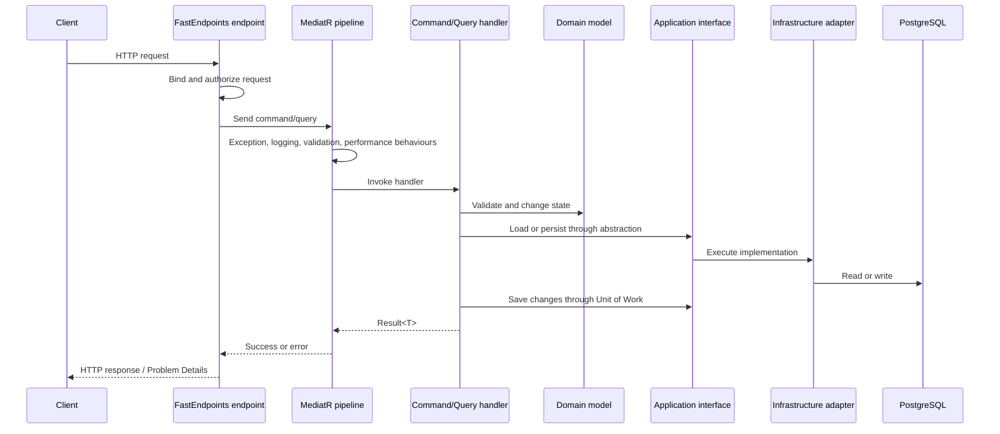
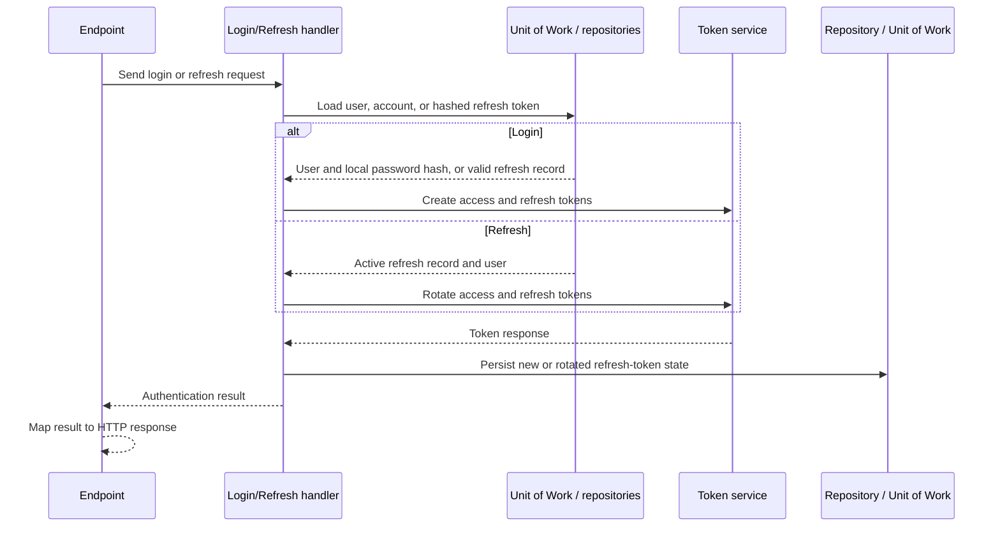

# Backend Architecture

## Overview

The Clothing Shop backend follows a **pragmatic implementation of Clean Architecture**. It is divided into four .NET projects whose dependencies point inward toward the domain:

- `Domain` contains the business model and has no dependency on other backend projects.
- `Application` defines use cases and depends on `Domain`.
- `Infrastructure` implements application contracts and depends on `Application`.
- `Api` is the HTTP composition root and depends on `Application` and `Infrastructure`.

The architecture keeps business rules independent of ASP.NET Core, EF Core, PostgreSQL, and external services. FastEndpoints do not contain business logic; handlers orchestrate application operations; domain entities protect their invariants; and infrastructure supplies the implementations required at runtime.

> **Scope:** This document covers the backend only. React, client routing, frontend state, and deployment topology are outside its scope.

---

## 1. Project Dependency Rule

This project uses **Clean Architecture**, organized as concentric circles with dependencies pointing inward toward the domain:



Each arrow represents a **Clean Architecture dependency** pointing inward: `Api` depends on `Application`, `Infrastructure` depends on `Application`, and `Application` depends on `Domain`. `Domain` sits at the centre and depends on no other backend project.

> **Reading the diagram:** the nested circles are Clean Architecture layers, not runtime call order. Outer layers may use inner layers, but inner layers never reference outer layers.

The direction of Clean Architecture dependencies is important:

| Project | Clean Architecture dependency | Purpose |
| --- | --- | --- |
| `Domain` | None; only `MediatR.Contracts` for domain-event notification contracts | Defines the core business model. |
| `Application` | `Domain` | Defines commands, queries, handlers, DTOs, validators, behaviours, and required interfaces. |
| `Infrastructure` | `Application` | Implements persistence and integration contracts. |
| `Api` | `Application` | Exposes HTTP endpoints and assembles concrete dependencies. |

The `Api` project is intentionally the outermost circle. Conceptually it depends inward on `Application`; at build level `Api.csproj` additionally references `Infrastructure.csproj` only so the composition root in `Api/Program.cs` can select concrete implementations (see trade-off 1 in Section 10). Application and domain code do not depend on `Api`.

### 1.1 Project locations

```text
backend/src/
├── Domain/          Business model
├── Application/     Use cases and application contracts
├── Infrastructure/  Data access and external integrations
└── Api/             HTTP endpoints and runtime composition
```

The dependency declarations can be inspected in:

- `backend/src/Domain/Domain.csproj`
- `backend/src/Application/Application.csproj`
- `backend/src/Infrastructure/Infrastructure.csproj`
- `backend/src/Api/Api.csproj`

---

## 2. Layer Responsibilities

## 2.1 Domain

`backend/src/Domain` is the centre of the backend. It contains the concepts and rules that describe the business independently of HTTP and persistence.

### Main responsibilities

- Aggregate/entity definitions.
- Entity identity and equality.
- Business invariants.
- Value objects and their validation.
- Domain-specific errors.
- Domain events.
- Shared auditing primitives.
- Result and error abstractions used to represent expected application outcomes.

### Example areas

| Area | Representative types |
| --- | --- |
| Catalog | `Product`, `Variant`, `Image`, `Category` |
| Identity | `User`, `Account`, `RefreshToken`, `VerificationToken` |
| Shopping | `Cart`, `CartItem` |
| Sales | `Purchase`, `PurchaseItem`, `Payment` |
| Shared primitives | `Entity`, `AuditableEntity`, `Result<T>`, `Error`, `DomainEvent` |

### Design rules

1. Domain objects do not reference ASP.NET Core, EF Core, PostgreSQL, MediatR, or infrastructure services.
2. Entity identity is established by `Id`, not by mutable business properties.
3. Public methods enforce state changes and domain invariants.
4. Expected domain failures are represented explicitly, normally through `Result` and domain-specific `Error` values.
5. State changes that affect other parts of the model are expressed as domain events when appropriate.

The key distinction is that the domain is not merely a collection of database-shaped classes. It is the layer responsible for deciding whether an operation is valid and how the business model changes.

---

## 2.2 Application

`backend/src/Application` contains the backend's use cases. It translates transport-level requests into operations on domain objects and coordinates repositories and external-service contracts.

### Feature organization

Features are grouped vertically by business capability:

```text
Application/Features/
├── Authentications/
│   ├── Commands/
│   └── Queries/
├── Products/
│   ├── Commands/
│   └── Queries/
├── Carts/
│   ├── Commands/
│   └── Queries/
└── Purchases/
    └── Command/
```

Within a feature, use cases commonly contain:

- A command or query representing the requested operation.
- A FluentValidation validator.
- A MediatR handler.
- Request, response, or DTO types.
- A test suite for application behaviour where covered.

### Main responsibilities

- Define commands, queries, handlers, and application DTOs.
- Coordinate repositories and Unit of Work.
- Invoke application interfaces required by the domain or use case.
- Enforce application-level validation.
- Return `Result<T>` values for expected failures.
- Coordinate persistence and allow domain-event dispatch through the Infrastructure save interceptor.

### Dependency inversion

Application code depends on contracts such as:

- `IRepository<T>`
- `IUnitOfWork`
- `IUser`
- Application interfaces for email, payment, token generation, hashing, and related services

The concrete implementations live in `Infrastructure`. This prevents handlers from being coupled directly to EF Core, JWT generation, SMTP, OAuth, or Chargily SDKs.

### Registration

`Application/DependencyInjection.cs` registers MediatR and the global request pipeline. The pipeline includes behaviours for:

- Unhandled exception translation.
- Request logging.
- FluentValidation request validation.
- Performance monitoring.

These behaviours execute around every dispatched command or query, providing consistent cross-cutting behaviour without repeating it in each handler.

---

## 2.3 Infrastructure

`backend/src/Infrastructure` supplies the technical implementations required by the application layer.

### Responsibilities

- EF Core `DbContext` and entity configurations.
- PostgreSQL migrations and schema mapping.
- Generic and feature-specific repositories.
- Unit of Work implementation.
- Auditing and domain-event interceptors.
- JWT token creation.
- Password and refresh-token services.
- Google OAuth integration.
- Chargily payment gateway integration.
- Email delivery and background jobs.
- Structured logging and external service configuration.

### Main folders

| Folder | Responsibility |
| --- | --- |
| `Data/` | `AppDbContext`, entity configurations, migrations, initializers, interceptors |
| `Repositories/` | Repository abstractions and concrete implementations |
| `UnitOfWork/` | Repository exposure and change-saving coordination |
| `Services/` | Tokens, OAuth, hashing, email, and payment adapters |
| `BackgroundJobs/` | Work executed outside the immediate request path |

Domain-event reaction handlers are not under `Infrastructure/`; the current handler lives in the Application project at `Application/Features/Carts/EventHandlers/` (for example, automatic cart provisioning on user creation).

`Infrastructure/DependencyInjection.cs` registers these implementations with the dependency-injection container. Although infrastructure owns adapter registration, `Api/Program.cs` remains the runtime composition root that calls the registration extensions.

---

## 2.4 Api

`backend/src/Api` is the delivery boundary. It translates HTTP requests into application commands or queries and translates application results into HTTP responses.

### Responsibilities

- Application startup and service composition.
- FastEndpoints endpoint definitions and route groups.
- Authentication and authorization policies.
- Rate-limit configuration and endpoint limits.
- Request DTOs and response DTOs.
- Mapping `Result<T>` failures to Problem Details responses.
- Swagger/OpenAPI exposure.
- Health checks, CORS, and HTTP pipeline configuration.
- Hosted/background service registration where required by the runtime.

### Endpoints

Endpoint files are organized under:

```text
Api/Endpoints/
├── Auth/
├── Product/
├── Cart/
├── Purchase/
├── User/
├── Category/
└── Dashboard/
```

An endpoint normally:

1. Declares its route, HTTP method, authentication, and authorization rules.
2. Accepts a request DTO or route/query parameters.
3. Builds a command or query.
4. Sends it through MediatR.
5. Returns the success value or maps a failure to an appropriate HTTP response.

Business decisions belong in the domain; use-case coordination belongs in the application layer. Endpoint classes remain focused on HTTP concerns.

---

## 3. Domain Modeling

## 3.1 Entities and identity

`Domain/Common/Entity.cs` provides the base entity identity. An entity represents a business object whose identity remains stable even when its descriptive properties change.

For example, changing a product's name or price does not change its `Id`. Equality and hash-code behaviour are therefore based on identity rather than all mutable values.

`Domain/Common/AuditableEntity.cs` adds creation and modification timestamps to persisted business records. Infrastructure populates those values through the auditing interceptor.

## 3.2 Value objects

Value objects represent concepts validated by value rather than identity. Examples include concepts such as email addresses, passwords, phone numbers, and addresses.

A value object is appropriate when:

- Its component values define the concept.
- Two instances with the same values represent the same value.
- Invalid states should be rejected during construction or creation.
- The object is safer when behaviour and validation travel with the data.

Some value objects are persisted inline through EF Core value conversions or owned types rather than as separate tables.

## 3.3 Result and error model

The domain provides `Result`, `Result<T>`, and `Error` to distinguish expected failures from exceptional failures.

This supports flows such as:

- Invalid credentials returning a domain/application error rather than throwing.
- A product that cannot be found.
- Insufficient stock.
- An invalid purchase state transition.
- A payment that is already processed.

HTTP concerns are not placed in the domain. The API decides which status code and Problem Details payload should represent each error when the result reaches the endpoint boundary.

## 3.4 Domain events

Domain events represent facts that have already happened in the domain, such as a user being created. They allow a primary operation to be separated from a secondary reaction without tightly coupling the two.

Entities collect domain events in memory. During `SaveChangesAsync`, the Infrastructure `DispatchDomainEventsInterceptor` finds tracked entities with pending events, publishes them through MediatR, and clears their in-memory event collections. Application notification handlers may then react by creating related state. Because dispatch occurs in the saving interceptor before EF Core executes the database write, the current implementation does not guarantee that handlers participate atomically with that write.

---

## 4. Request Processing Pipeline

A typical endpoint request follows this path:



### Pipeline responsibilities

- **Unhandled exception behaviour:** converts unexpected exceptions into consistent application errors.
- **Logging behaviour:** records request execution and relevant metadata.
- **Validation behaviour:** validates commands and queries before a handler runs.
- **Performance behaviour:** measures request duration and warns when execution exceeds a configured threshold.

The endpoint does not need to invoke each concern manually; MediatR applies the registered pipeline behaviours around dispatched requests.

---

## 5. Persistence Architecture

## 5.1 `AppDbContext`

`Infrastructure/Data/AppDbContext.cs` is the EF Core entry point for PostgreSQL. It defines `DbSet<T>` properties and applies entity-specific configurations.

The database is divided into four logical schemas:

- `catalog`
- `identity`
- `shopping`
- `sales`

Detailed table and relationship documentation is available in [`Database-Design.md`](Database-Design.md).

## 5.2 Entity configuration

Each persistence-sensitive entity has a configuration class under `Infrastructure/Data/Configurations`. These classes control details such as:

- Table and schema names.
- Keys and indexes.
- Maximum lengths and precision.
- Required and optional properties.
- Check constraints.
- Relationships and delete behaviour.
- Value conversions and owned types.

This keeps persistence decisions out of domain entities and prevents the domain model from depending on EF Core attributes.

## 5.3 Repositories and Unit of Work

Application handlers normally do not inject `AppDbContext` directly. They use abstractions such as `IRepository<T>` and `IUnitOfWork`.

This provides several benefits:

- Use cases depend on application contracts rather than EF Core.
- Queries can be expressed through repository-specific methods when needed.
- Saving multiple aggregate changes is coordinated in one place.
- Infrastructure can evolve persistence implementation without changing handlers.

`Infrastructure/UnitOfWork/UnitOfWork.cs` coordinates persistence by exposing repositories and delegating `SaveChangesAsync` to `AppDbContext`. The current implementation does not explicitly create a transaction or expose begin/commit methods; a single `SaveChangesAsync` provides EF Core's normal atomic save boundary for that batch.

## 5.4 Interceptors

### `AuditableEntityInterceptor`

This interceptor assigns creation and modification timestamps to entities derived from `AuditableEntity`, keeping audit metadata consistent outside individual handlers.

### `DispatchDomainEventsInterceptor`

This interceptor identifies domain events raised by tracked entities and publishes them during the EF Core saving interception stage. It clears each entity's pending event collection before publishing. The current `SavingChangesAsync` override does not queue dispatch with `SavedChangesAsync`, so handlers run before the database write executes and are not guaranteed to share the write's atomic outcome.

The ordering and transactional behaviour of these interceptors are important architectural details. `AuditableEntityInterceptor` is registered before `DispatchDomainEventsInterceptor`, so timestamps are assigned before pending events are published. Domain-event handlers can initiate additional saves; the current interceptor does not provide an outbox, deferred after-save dispatch, or explicit transaction coordination.

---

## 6. External Integrations

External systems are generally represented by application interfaces and implemented in infrastructure. Most handlers depend on those contracts rather than vendor SDKs; the current payment contract is an exception because it exposes a Chargily `CheckoutStatus` type in its status-query method.

| Integration | Application concern | Infrastructure implementation |
| --- | --- | --- |
| PostgreSQL | Persistence contracts | EF Core repositories and Unit of Work |
| JWT | Access and refresh-token operations | Token provider |
| Passwords | Hashing and verification | Security service |
| Google OAuth | Google identity verification | OAuth service |
| Chargily | Checkout/payment interactions | Payment gateway service |
| Email | Sending messages | Email service and background job |
| Logging | Diagnostic output | Serilog and application behaviours |

This keeps most use cases and domain rules independent of third-party SDK details. The payment contract is not fully vendor-neutral yet; its status model should eventually be replaced with an application-owned type if strict adapter isolation is required (see trade-off 7 in §10).

---

## 7. Representative Backend Flows

## 7.1 Login and token refresh



The endpoint and token service should not be moved into the domain. Authentication state and token persistence are application/infrastructure concerns, while user identity and account concepts remain in the domain.

## 7.2 Product query

1. `Api/Endpoints/Product/GetProducts.cs` binds pagination and filter criteria and dispatches a paginated product query.
2. `Api/Endpoints/Product/GetProductById.cs` binds a product identifier and dispatches a single-product query.
3. The corresponding query handlers apply the product use-case logic.
4. The handlers use the product repository abstraction to retrieve and project data.
5. The infrastructure implementation queries EF Core.
6. The endpoints map success or failure to an HTTP response.

Read operations follow the same dispatch pipeline as writes, but do not invoke Unit of Work unless a domain event or mutation requires persistence.

## 7.3 Cart update

1. The current user is obtained from the API boundary.
2. A cart command is dispatched.
3. The handler locates the user's cart through application contracts.
4. Domain methods add, update, or remove the selected variant.
5. The unit of work persists the change.
6. Auditing and domain-event interceptors run during saving.

Cart quantities and relationships are domain rules; EF change tracking is persistence detail.

## 7.4 Checkout and purchase creation

1. An authenticated endpoint builds a purchase command.
2. The handler validates the selected products or cart variants.
3. Inventory and pricing rules are applied.
4. A purchase and snapshotted purchase items are created.
5. Stock is reduced through the relevant domain operation.
6. Payment data is created or associated with the purchase.
7. The unit of work saves the pending purchase, payment, and stock changes in one EF Core save operation.
8. After that local save, the handler invokes the payment gateway contract and then saves the checkout identifier.
9. The endpoint returns the checkout information required by the client.

The purchase handler coordinates this process; it does not contain Chargily-specific SDK calls.

> **Atomicity note:** steps 7–8 are not one atomic unit. If `CreateCheckout` throws `PaymentGatewayException`, the handler compensates in the same request by marking the payment `Failed`, restoring variant stock, saving again, and returning `CHECKOUT_FAILED`; that `Failed` state is retryable through `RetryPurchase` (which re-reserves stock, resets the payment to `Pending`, creates a new checkout, and attaches the new checkout id before saving). However, a crash or unhandled failure *between* the first save and the gateway call, or between a successful gateway call and the second save (including an `AttachCheckout` validation failure, which currently returns without saving), can leave a `Pending` purchase with reduced stock but no checkout/transaction id. `RetryPurchase` currently only accepts `Failed` payments, so that orphaned-`Pending` case has no documented automatic recovery; see trade-off 6 in §10.

## 7.5 Payment webhook

The payment webhook is an external, asynchronous boundary:

1. The webhook endpoint receives the provider request.
2. Provider-specific validation and data mapping occur at the API boundary.
3. The endpoint dispatches a payment-webhook command.
4. The handler loads the purchase/payment context.
5. A paid payment clears a cart when applicable; a failed or expired/canceled outcome restores stock; the paid path schedules a background purchase-notification email.
6. Duplicate callbacks are ignored when the payment is already `Paid` or `Failed`; non-terminal provider states also produce no state change.
7. Changes are persisted before a successful webhook response is returned.

The webhook endpoint and the internal payment command should remain separate: the first handles provider HTTP details; the second performs the business operation.

---

## 8. Composition Root and Startup

`Api/Program.cs` is the composition root. It creates the host, configures services, registers dependencies, builds the pipeline, and starts the application.

The registration extensions divide responsibility cleanly:

```text
Program.cs
├── services.AddPresentation(builder.Configuration)
├── services.AddApplication()
└── services.AddInfrastructure(builder.Configuration)
```

- `Application/DependencyInjection.cs` registers use cases and MediatR pipeline behaviour.
- `Infrastructure/DependencyInjection.cs` registers persistence and external-service implementations.
- `Api/DependencyInjection.cs` registers HTTP/API concerns such as authentication, authorization, rate limiting, FastEndpoints, and presentation services.

This keeps startup explicit and allows technical implementations to be replaced through dependency injection without changing use cases.

---

## 9. Adding a New Feature

A feature should be added according to the layer that owns its responsibility.

### Step 1: Model the rule in `Domain`

Add or update:

- Entity or value object.
- Business invariant.
- Domain-specific error.
- Domain event, if another capability must react.

Do not add EF Core or HTTP concerns here.

### Step 2: Define the use case in `Application`

Create the feature folder and add:

- Command or query.
- Handler.
- Validator.
- DTOs.
- Application interface if a new technical capability is required.

Keep the handler focused on orchestration and expected failure translation.

### Step 3: Implement the contract in `Infrastructure`

Add the required implementation, such as:

- Entity configuration.
- Repository method.
- External adapter.
- Background job or event handler.

Only technical implementations belong here.

### Step 4: Expose the HTTP contract in `Api`

Add:

- Endpoint.
- Request/response DTOs.
- Route and endpoint group.
- Authentication and authorization policy.
- Rate-limit requirements, where appropriate.
- Result-to-Problem-Details mapping.

### Step 5: Verify the dependency direction

Before finishing, confirm:

- `Domain` references no other backend project.
- `Application` references only `Domain`.
- `Infrastructure` references `Application`, not `Api`.
- `Api` does not contain domain business rules.
- Handlers depend on contracts rather than concrete infrastructure types.

---

## 10. Architectural Trade-offs in the Current Project

The backend is Clean Architecture in structure, but it is a **pragmatic** implementation rather than a purist one.

1. **The API references Infrastructure directly.** This is normal for the composition root: startup must select concrete implementations.
2. **Domain events use a narrow MediatR contract.** `DomainEvent` implements `INotification` from `MediatR.Contracts`; domain types do not depend on the full MediatR implementation package or on application/infrastructure projects.
3. **Domain events are dispatched before the database write.** The saving interceptor publishes and clears pending events before EF Core executes the save. Handlers may run additional saves, but the current implementation has no outbox or explicit transaction coordinator guaranteeing one atomic outcome.
4. **Result-based failures coexist with exceptions.** Expected business failures use `Result`; unexpected technical failures still flow through the exception handling pipeline and global error handling.
5. **Infrastructure owns authentication-related adapters.** JWT, OAuth, and password implementations satisfy application/security contracts, while API policy configuration remains at the HTTP boundary.
6. **Purchase creation and the Chargily checkout call are not committed atomically.** The handler saves the purchase/payment/stock reduction first (§7.4, step 7), then calls the external gateway and saves the checkout id in a second write (step 8). A gateway exception is compensated in-request (payment marked `Failed`, stock restored, retryable via `RetryPurchase`), but a crash or unhandled failure between the two saves can leave a `Pending` purchase with reduced stock and no checkout id—a state `RetryPurchase` does not currently accept.
7. **The payment contract leaks a vendor status type.** `IPaymentGatewayService.GetCheckoutStatus` returns Chargily's `CheckoutStatus`; replacing it with an application-owned status model would restore strict adapter isolation (see §6).

These are implementation details to preserve consciously rather than assumptions to hide.

---

## 11. Key Source Map

| Concern | Primary source location |
| --- | --- |
| Domain entities and rules | `backend/src/Domain` |
| Result and error model | `backend/src/Domain/Common/Results` |
| Domain events | `backend/src/Domain/Common/DomainEvent.cs` |
| Feature use cases | `backend/src/Application/Features` |
| MediatR and validation pipeline | `backend/src/Application/DependencyInjection.cs` |
| Request behaviours | `backend/src/Application/Common/Behaviours` |
| Repository and Unit of Work contracts | `backend/src/Application/Common/Interfaces` |
| EF Core context and configurations | `backend/src/Infrastructure/Data` |
| Repository implementations | `backend/src/Infrastructure/Repositories` |
| Unit of Work implementation | `backend/src/Infrastructure/UnitOfWork` |
| External adapters | `backend/src/Infrastructure/Services` |
| Background jobs | `backend/src/Infrastructure/BackgroundJobs` |
| HTTP endpoints | `backend/src/Api/Endpoints` |
| HTTP/API service registration | `backend/src/Api/DependencyInjection.cs` |
| Runtime composition | `backend/src/Api/Program.cs` |

> **Path casing note:** The project folder is `Api`, so source paths should use `backend/src/Api`, not `backend/src/API`.

---

## Summary

The backend architecture uses an inward dependency flow:

```text
Api -> Application -> Domain
Api -> Infrastructure -> Application -> Domain
```

`Domain` protects the business model, `Application` defines and coordinates use cases, `Infrastructure` implements technical contracts, and `Api` exposes the system over HTTP. Feature-oriented use cases, MediatR behaviours, repository and Unit of Work abstractions, EF Core persistence, domain events, and adapter-based integrations keep the main business rules independent of the web and database frameworks.