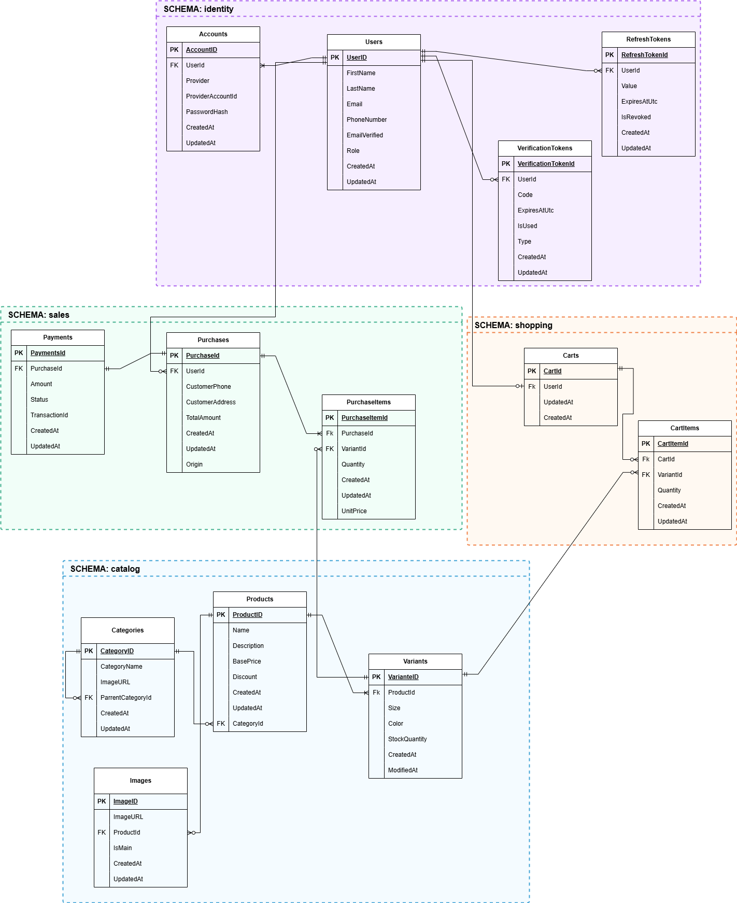
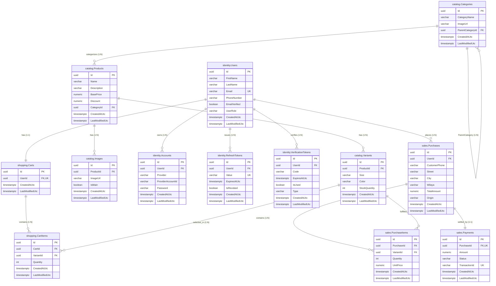

# Database Design & Relational Schema

This document details the PostgreSQL database design for the **Clothing Shop** e-commerce platform. The database is partitioned into **four distinct logical schemas** reflecting domain boundaries: `catalog`, `identity`, `sales`, and `shopping`.

---

## 1. Visual Entity-Relationship Diagram (ERD)

The database schema is visualized in the draw.io diagram below, with each table grouped inside its PostgreSQL schema:



> The editable draw.io source for the diagram is available at [`assets/database.drawio`](assets/database.drawio). The rendered image is [`assets/database.png`](assets/database.png). The source preserves the original diagram's labels where they differ from the canonical EF Core model; the column specifications and Mermaid diagram below use the current application/database names. An interactive, renderable Mermaid ER diagram is also provided in [Section 3](#3-mermaid-entity-relationship-diagram) for environments that render GitHub Flavored Markdown diagrams natively.

---

## 2. PostgreSQL Schemas Overview

The database uses schema separation to isolate bounded contexts, prevent table naming collisions, and provide clear ownership:

| Schema         | Domain Focus                                                                                    | Relational Tables                                          |
| -------------- | ----------------------------------------------------------------------------------------------- | ---------------------------------------------------------- |
| **`catalog`**  | Product catalog, hierarchical categories, product variants (SKUs), and product media            | `Categories`, `Products`, `Variants`, `Images`             |
| **`identity`** | User management, local & OAuth credential providers, refresh tokens, and code verification      | `Users`, `Accounts`, `RefreshTokens`, `VerificationTokens` |
| **`sales`**    | Order management, snapshotted line items, owned value objects (addresses), and payment statuses | `Purchases`, `PurchaseItems`, `Payments`                   |
| **`shopping`** | Customer shopping bags / carts and active selected variants                                     | `Carts`, `CartItems`                                       |

All entities inherit from `AuditableEntity` (implementing `CreatedAtUtc timestamptz` and `LastModifiedUtc timestamptz?`). Primary keys across all 13 tables are client/domain-generated `uuid` values (`ValueGeneratedNever()`).

---

## 3. Entity-Relationship Diagram



---

## 4. Schema-by-Schema Table Specifications

### 4.1 Schema: `catalog`

The `catalog` schema defines product merchandise, hierarchical taxonomy, inventory units (variants), and visual gallery assets.

#### Table: `catalog.Categories`

Stores product categories in a self-referencing hierarchy (e.g., _Men_ -> _Hoodies_).

| Column Name        | PostgreSQL Type | Nullable | Default | Constraints & Indexes                    | Description                            |
| ------------------ | --------------- | -------- | ------- | ---------------------------------------- | -------------------------------------- |
| `Id`               | `uuid`          | No       | None    | **PK** (`ValueGeneratedNever`)           | Unique category identifier             |
| `CategoryName`     | `varchar(100)`  | No       | None    | Max length 100                           | Display name of the category           |
| `ImageUrl`         | `varchar(500)`  | Yes      | `NULL`  | Max length 500                           | Relative path to category banner image |
| `ParentCategoryId` | `uuid`          | Yes      | `NULL`  | **FK** -> `catalog.Categories(Id)`, `IX` | Self-reference to parent category      |
| `CreatedAtUtc`     | `timestamptz`   | No       | None    | Audit column                             | Entity creation timestamp (UTC)        |
| `LastModifiedUtc`  | `timestamptz`   | Yes      | `NULL`  | Audit column                             | Last modification timestamp (UTC)      |

- **Foreign Key Behavior**: `ParentCategoryId` references `catalog.Categories(Id)` with `ON DELETE RESTRICT`. A parent category cannot be deleted if child subcategories exist.

---

#### Table: `catalog.Products`

Represents high-level products before sizing/coloration specialization.

| Column Name       | PostgreSQL Type | Nullable | Default | Constraints & Indexes                    | Description                                 |
| ----------------- | --------------- | -------- | ------- | ---------------------------------------- | ------------------------------------------- |
| `Id`              | `uuid`          | No       | None    | **PK** (`ValueGeneratedNever`)           | Unique product identifier                   |
| `Name`            | `varchar(200)`  | No       | None    | `IX_Products_Name`                       | Product commercial title                    |
| `Description`     | `varchar(2000)` | Yes      | `NULL`  | Max length 2000                          | Detailed markdown/text product description  |
| `BasePrice`       | `numeric(18,2)` | No       | None    | Precision (18,2)                         | Default catalog listing price in DZD        |
| `Discount`        | `numeric(6,2)`  | Yes      | `NULL`  | Precision (6,2)                          | Discount amount in DZD applied to BasePrice |
| `CategoryId`      | `uuid`          | No       | None    | **FK** -> `catalog.Categories(Id)`, `IX` | Assigned parent category                    |
| `CreatedAtUtc`    | `timestamptz`   | No       | None    | Audit column                             | Entity creation timestamp (UTC)             |
| `LastModifiedUtc` | `timestamptz`   | Yes      | `NULL`  | Audit column                             | Last modification timestamp (UTC)           |

- **Foreign Key Behavior**: `CategoryId` references `catalog.Categories(Id)` with `ON DELETE RESTRICT`. A category cannot be deleted while products are linked to it.

---

#### Table: `catalog.Variants`

Represents discrete purchasable Stock Keeping Units (SKUs) distinguished by size and color.

| Column Name       | PostgreSQL Type | Nullable | Default | Constraints & Indexes                  | Description                              |
| ----------------- | --------------- | -------- | ------- | -------------------------------------- | ---------------------------------------- |
| `Id`              | `uuid`          | No       | None    | **PK** (`ValueGeneratedNever`)         | Unique variant SKU identifier            |
| `ProductId`       | `uuid`          | No       | None    | **FK** -> `catalog.Products(Id)`, `IX` | Parent product reference                 |
| `Size`            | `varchar(10)`   | No       | None    | Max length 10                          | Garment size (`s`, `m`, `l`, `xl`, etc.) |
| `Color`           | `varchar(50)`   | No       | None    | Max length 50                          | Color name or descriptor                 |
| `StockQuantity`   | `integer`       | No       | None    | `CK_Variant_StockQuantity_NonNegative` | Current in-stock inventory count         |
| `CreatedAtUtc`    | `timestamptz`   | No       | None    | Audit column                           | Entity creation timestamp (UTC)          |
| `LastModifiedUtc` | `timestamptz`   | Yes      | `NULL`  | Audit column                           | Last modification timestamp (UTC)        |

- **Check Constraints**: `CHECK ("StockQuantity" >= 0)` ensures inventory counts never become negative.
- **Foreign Key Behavior**: `ProductId` references `catalog.Products(Id)` with `ON DELETE CASCADE`. Removing a product cleans up all its inventory variants.

---

#### Table: `catalog.Images`

Image gallery storage referencing images stored under physical storage (`wwwroot/images/products/`).

| Column Name       | PostgreSQL Type | Nullable | Default | Constraints & Indexes                  | Description                                  |
| ----------------- | --------------- | -------- | ------- | -------------------------------------- | -------------------------------------------- |
| `Id`              | `uuid`          | No       | None    | **PK** (`ValueGeneratedNever`)         | Unique image identifier                      |
| `ProductId`       | `uuid`          | No       | None    | **FK** -> `catalog.Products(Id)`, `IX` | Parent product reference                     |
| `ImageUrl`        | `varchar(500)`  | No       | None    | Max length 500                         | Storage URL path (`/images/products/...`)    |
| `IsMain`          | `boolean`       | No       | `false` | Boolean flag                           | Identifies primary display image for product |
| `CreatedAtUtc`    | `timestamptz`   | No       | None    | Audit column                           | Entity creation timestamp (UTC)              |
| `LastModifiedUtc` | `timestamptz`   | Yes      | `NULL`  | Audit column                           | Last modification timestamp (UTC)            |

- **Foreign Key Behavior**: `ProductId` references `catalog.Products(Id)` with `ON DELETE CASCADE`.

---

### 4.2 Schema: `identity`

The `identity` schema manages authentication credentials, user roles, security tokens, and multi-provider auth accounts.

#### Table: `identity.Users`

Core user entity storing personal demographics, role, and verification status.

| Column Name       | PostgreSQL Type | Nullable | Default      | Constraints & Indexes                    | Description                             |
| ----------------- | --------------- | -------- | ------------ | ---------------------------------------- | --------------------------------------- |
| `Id`              | `uuid`          | No       | None         | **PK** (`ValueGeneratedNever`)           | Unique user account identifier          |
| `FirstName`       | `varchar(50)`   | No       | None         | Max length 50                            | Customer given name                     |
| `LastName`        | `varchar(50)`   | No       | None         | Max length 50                            | Customer family name                    |
| `Email`           | `varchar(200)`  | No       | None         | **UQ** (`IX_User_Email`), Max length 200 | Normalized email address                |
| `PhoneNumber`     | `varchar(15)`   | No       | None         | `IX_User_PhoneNumber`, Max length 15     | Algerian mobile phone number            |
| `EmailVerified`   | `boolean`       | No       | `false`      | Boolean flag                             | Account email confirmation state        |
| `UserRole`        | `varchar(50)`   | No       | `'Customer'` | `CK_USER_ROLE`                           | Access level: `'Customer'` or `'Admin'` |
| `CreatedAtUtc`    | `timestamptz`   | No       | None         | Audit column                             | Entity creation timestamp (UTC)         |
| `LastModifiedUtc` | `timestamptz`   | Yes      | `NULL`       | Audit column                             | Last modification timestamp (UTC)       |

- **Check Constraints**: `CHECK ("UserRole" IN ('Admin', 'Customer'))`.
- **Unique Indexes**: `IX_User_Email` enforces global uniqueness across all user emails.

---

#### Table: `identity.Accounts`

Supports local authentication and external OAuth identity providers (e.g., Google).

| Column Name         | PostgreSQL Type | Nullable | Default | Constraints & Indexes          | Description                                  |
| ------------------- | --------------- | -------- | ------- | ------------------------------ | -------------------------------------------- |
| `Id`                | `uuid`          | No       | None    | **PK** (`ValueGeneratedNever`) | Unique account record identifier             |
| `UserId`            | `uuid`          | No       | None    | **FK** -> `identity.Users(Id)` | User owner                                   |
| `Provider`          | `varchar(50)`   | No       | None    | Max length 50                  | Identity provider (`'local'`, `'Google'`)    |
| `ProviderAccountId` | `varchar(255)`  | Yes      | `NULL`  | Max length 255                 | External provider subject/user ID            |
| `Password`          | `varchar(150)`  | Yes      | `NULL`  | Max length 150                 | BCrypt hashed password (local provider only) |
| `CreatedAtUtc`      | `timestamptz`   | No       | None    | Audit column                   | Entity creation timestamp (UTC)              |
| `LastModifiedUtc`   | `timestamptz`   | Yes      | `NULL`  | Audit column                   | Last modification timestamp (UTC)            |

- **Unique Constraints**: Composite unique index on `(Provider, ProviderAccountId)` prevents duplicate external provider account bindings.
- **Foreign Key Behavior**: `UserId` references `identity.Users(Id)` with `ON DELETE CASCADE`.

---

#### Table: `identity.RefreshTokens`

Stores cryptographically hashed refresh tokens for silent authentication renewal.

| Column Name       | PostgreSQL Type | Nullable | Default | Constraints & Indexes             | Description                            |
| ----------------- | --------------- | -------- | ------- | --------------------------------- | -------------------------------------- |
| `Id`              | `uuid`          | No       | None    | **PK** (`ValueGeneratedNever`)    | Unique token record identifier         |
| `UserId`          | `uuid`          | No       | None    | **FK** -> `identity.Users(Id)`    | User to whom token was issued          |
| `Value`           | `varchar(500)`  | No       | None    | **UQ** (`IX_RefreshTokens_Value`) | SHA-256 hashed refresh token string    |
| `ExpiresAtUtc`    | `timestamptz`   | No       | None    | Expiration boundary               | Token validity expiration timestamp    |
| `IsRevoked`       | `boolean`       | No       | `false` | Revocation status                 | Invalidates token upon rotation/logout |
| `CreatedAtUtc`    | `timestamptz`   | No       | None    | Audit column                      | Entity creation timestamp (UTC)        |
| `LastModifiedUtc` | `timestamptz`   | Yes      | `NULL`  | Audit column                      | Last modification timestamp (UTC)      |

- **Security Architecture**: Token values stored in database are SHA-256 hashes of the 64-byte random values issued in the client's `httpOnly` cookie.
- **Foreign Key Behavior**: `UserId` references `identity.Users(Id)` with `ON DELETE CASCADE`.

---

#### Table: `identity.VerificationTokens`

Stores temporary verification codes for email confirmation and self-service password resets.

| Column Name       | PostgreSQL Type | Nullable | Default               | Constraints & Indexes                | Description                                |
| ----------------- | --------------- | -------- | --------------------- | ------------------------------------ | ------------------------------------------ |
| `Id`              | `uuid`          | No       | None                  | **PK** (`ValueGeneratedNever`)       | Unique verification record identifier      |
| `UserId`          | `uuid`          | No       | None                  | **FK** -> `identity.Users(Id)`, `IX` | Target user account                        |
| `Code`            | `varchar(10)`   | No       | None                  | Max length 10                        | 6-digit numeric verification code          |
| `ExpiresAtUtc`    | `timestamptz`   | No       | None                  | Short-lived (5 min)                  | Code expiration timestamp                  |
| `IsUsed`          | `boolean`       | No       | `false`               | Consumption flag                     | Prevents replay attacks                    |
| `Type`            | `varchar(30)`   | No       | `'EmailVerification'` | `CK_VerificationTokens_Type`         | `'EmailVerification'` or `'PasswordReset'` |
| `CreatedAtUtc`    | `timestamptz`   | No       | None                  | Audit column                         | Entity creation timestamp (UTC)            |
| `LastModifiedUtc` | `timestamptz`   | Yes      | `NULL`                | Audit column                         | Last modification timestamp (UTC)          |

- **Check Constraints**: `CHECK ("Type" IN ('EmailVerification', 'PasswordReset'))`.
- **Foreign Key Behavior**: `UserId` references `identity.Users(Id)` with `ON DELETE CASCADE`.

---

### 4.3 Schema: `shopping`

The `shopping` schema maintains customer shopping sessions and cart contents.

#### Table: `shopping.Carts`

Each user has exactly one cart, automatically provisioned upon account creation via domain events.

| Column Name       | PostgreSQL Type | Nullable | Default | Constraints & Indexes                  | Description                         |
| ----------------- | --------------- | -------- | ------- | -------------------------------------- | ----------------------------------- |
| `Id`              | `uuid`          | No       | None    | **PK** (`ValueGeneratedNever`)         | Unique cart identifier              |
| `UserId`          | `uuid`          | No       | None    | **FK** -> `identity.Users(Id)`, **UQ** | Enforces 1:1 relationship with User |
| `CreatedAtUtc`    | `timestamptz`   | No       | None    | Audit column                           | Entity creation timestamp (UTC)     |
| `LastModifiedUtc` | `timestamptz`   | Yes      | `NULL`  | Audit column                           | Last modification timestamp (UTC)   |

- **Cardinality & Key Behavior**: `UserId` is marked unique (`HasIndex(c => c.UserId).IsUnique()`), establishing a strict **1:1** mapping with `identity.Users`.
- **Foreign Key Behavior**: `UserId` references `identity.Users(Id)` with `ON DELETE CASCADE`.

---

#### Table: `shopping.CartItems`

Line items present inside a customer's active cart.

| Column Name       | PostgreSQL Type | Nullable | Default | Constraints & Indexes                  | Description                       |
| ----------------- | --------------- | -------- | ------- | -------------------------------------- | --------------------------------- |
| `Id`              | `uuid`          | No       | None    | **PK** (`ValueGeneratedNever`)         | Unique line item identifier       |
| `CartId`          | `uuid`          | No       | None    | **FK** -> `shopping.Carts(Id)`         | Parent cart reference             |
| `VariantId`       | `uuid`          | No       | None    | **FK** -> `catalog.Variants(Id)`, `IX` | Target product variant SKU        |
| `Quantity`        | `integer`       | No       | None    | `CK_CartItems_Quantity`                | Item count in cart                |
| `CreatedAtUtc`    | `timestamptz`   | No       | None    | Audit column                           | Entity creation timestamp (UTC)   |
| `LastModifiedUtc` | `timestamptz`   | Yes      | `NULL`  | Audit column                           | Last modification timestamp (UTC) |

- **Unique Constraints**: Composite unique index on `(CartId, VariantId)` ensures a variant appears at most once per cart (quantity increments on repeat additions).
- **Check Constraints**: `CHECK ("Quantity" >= 0)`.
- **Foreign Key Behavior**:
  - `CartId` -> `shopping.Carts(Id)` with `ON DELETE CASCADE`.
  - `VariantId` -> `catalog.Variants(Id)` with `ON DELETE CASCADE`.

---

### 4.4 Schema: `sales`

The `sales` schema records checkout transactions, snapshotted prices, shipping destinations, and payment gateway interactions.

#### Table: `sales.Purchases`

Captures an immutable purchase order with an embedded/owned address value object.

| Column Name       | PostgreSQL Type | Nullable | Default | Constraints & Indexes                | Description                          |
| ----------------- | --------------- | -------- | ------- | ------------------------------------ | ------------------------------------ |
| `Id`              | `uuid`          | No       | None    | **PK** (`ValueGeneratedNever`)       | Unique purchase order identifier     |
| `UserId`          | `uuid`          | No       | None    | **FK** -> `identity.Users(Id)`, `IX` | Purchasing customer reference        |
| `CustomerPhone`   | `varchar(15)`   | No       | None    | Max length 15                        | Customer phone number at checkout    |
| `Street`          | `varchar(200)`  | No       | None    | Owned VO (`CustomerAddress`)         | Delivery street address              |
| `City`            | `varchar(100)`  | No       | None    | Owned VO (`CustomerAddress`)         | Delivery city                        |
| `Wilaya`          | `varchar(100)`  | No       | None    | Owned VO (`CustomerAddress`)         | Algerian province (Wilaya)           |
| `TotalAmount`     | `numeric(20,2)` | No       | None    | Precision (20,2)                     | Total order monetary sum in DZD      |
| `Origin`          | `varchar(20)`   | No       | None    | Max length 20                        | Order source: `'BuyNow'` or `'Cart'` |
| `CreatedAtUtc`    | `timestamptz`   | No       | None    | Audit column                         | Order submission timestamp (UTC)     |
| `LastModifiedUtc` | `timestamptz`   | Yes      | `NULL`  | Audit column                         | Last status change timestamp (UTC)   |

- **Owned Value Object Mapping**: `CustomerAddress` is mapped flatly onto `Street`, `City`, and `Wilaya` within the `Purchases` table (`OwnsOne(p => p.CustomerAddress)`).
- **Foreign Key Behavior**: `UserId` references `identity.Users(Id)` with `ON DELETE RESTRICT`. Users with existing purchases cannot be deleted to maintain legal and financial audit logs.

---

#### Table: `sales.PurchaseItems`

Represents individual items contained within a completed order.

| Column Name       | PostgreSQL Type | Nullable | Default | Constraints & Indexes                  | Description                       |
| ----------------- | --------------- | -------- | ------- | -------------------------------------- | --------------------------------- |
| `Id`              | `uuid`          | No       | None    | **PK** (`ValueGeneratedNever`)         | Unique purchase item identifier   |
| `PurchaseId`      | `uuid`          | No       | None    | **FK** -> `sales.Purchases(Id)`, `IX`  | Order reference                   |
| `VariantId`       | `uuid`          | No       | None    | **FK** -> `catalog.Variants(Id)`, `IX` | Specific purchased SKU            |
| `Quantity`        | `integer`       | No       | None    | `CK_PurchaseItems_Quantity`            | Units purchased                   |
| `UnitPrice`       | `numeric(20,2)` | No       | None    | Precision (20,2)                       | Snapshot price in DZD at checkout |
| `CreatedAtUtc`    | `timestamptz`   | No       | None    | Audit column                           | Entity creation timestamp (UTC)   |
| `LastModifiedUtc` | `timestamptz`   | Yes      | `NULL`  | Audit column                           | Last modification timestamp (UTC) |

- **Financial Integrity**: `UnitPrice` is frozen at order creation (`Product.BasePrice - Product.Discount`), isolating order history from subsequent catalog price fluctuations.
- **Check Constraints**: `CHECK ("Quantity" > 0)`.
- **Foreign Key Behavior**:
  - `PurchaseId` -> `sales.Purchases(Id)` with `ON DELETE CASCADE`.
  - `VariantId` -> `catalog.Variants(Id)` is currently generated with `ReferentialAction.SetNull`, but `VariantId` is declared `NOT NULL` in both the EF model and the initial migration. This is an implementation inconsistency: PostgreSQL cannot execute `ON DELETE SET NULL` for this non-nullable column. Until the relationship is changed to a compatible delete behavior and a corrective migration is applied, deleting a referenced variant will fail rather than preserve the purchase item with a null reference.

---

#### Table: `sales.Payments`

Tracks payment gateway records (Chargily Pay integration) linked 1:1 to a purchase order.

| Column Name       | PostgreSQL Type | Nullable | Default     | Constraints & Indexes                   | Description                                     |
| ----------------- | --------------- | -------- | ----------- | --------------------------------------- | ----------------------------------------------- |
| `Id`              | `uuid`          | No       | None        | **PK** (`ValueGeneratedNever`)          | Unique payment record identifier                |
| `PurchaseId`      | `uuid`          | No       | None        | **FK** -> `sales.Purchases(Id)`, **UQ** | 1:1 purchase order binding                      |
| `Amount`          | `numeric(20,2)` | No       | None        | `CK_Payments_Amount`                    | Settled payment total in DZD                    |
| `Status`          | `varchar(30)`   | No       | `'Pending'` | `CK_Payments_Status`                    | `'Pending'`, `'Paid'`, `'Failed'`, `'Refunded'` |
| `TransactionId`   | `varchar(255)`  | Yes      | `NULL`      | **UQ** (`IX_Payments_TransactionId`)    | External Chargily checkout/tx ID                |
| `CreatedAtUtc`    | `timestamptz`   | No       | None        | Audit column                            | Record creation timestamp (UTC)                 |
| `LastModifiedUtc` | `timestamptz`   | Yes      | `NULL`      | Audit column                            | Last gateway status sync (UTC)                  |

- **Check Constraints**:
  - `CHECK ("Amount" >= 0)`
  - `CHECK ("Status" IN ('Pending', 'Paid', 'Failed', 'Refunded'))`
- **Status scope**: `Refunded` is supported by the database constraint and domain enum, but the current payment webhook flow only processes `Paid` and `Failed`; no automated refund workflow is implemented.
- **Unique Indexes**:
  - `PurchaseId` is unique, enforcing strict **1:1** purchase-to-payment relationship.
  - `TransactionId` is unique (`IsUnique()`), guaranteeing idempotency when handling Chargily webhook notifications.
- **Foreign Key Behavior**: `PurchaseId` references `sales.Purchases(Id)` with `ON DELETE CASCADE`.

---

## 5. Relationships & Cardinality Deep-Dive

This section clarifies the exact multiplicities, foreign key navigation properties, and referential integrity strategies implemented across schema boundaries.

### 5.1 Intra-Schema Relationships

#### Catalog Domain

- **`Categories` -> `Categories` (Self-Referencing 1:N)**:
  - Parent categories contain zero or more subcategories (`Subcategories`).
  - Child categories reference an optional parent (`ParentCategoryId`).
  - `ON DELETE RESTRICT` prevents accidental deletion of entire taxonomy trees.
- **`Categories` -> `Products` (1:N)**:
  - A category groups zero or many products.
  - `ON DELETE RESTRICT` ensures categories with active merchandise cannot be orphaned.
- **`Products` -> `Variants` (1:N)**:
  - A product owns one or more physical SKU variants.
  - `ON DELETE CASCADE` cascades product deletions down to all underlying size/color variants.
- **`Products` -> `Images` (1:N)**:
  - A product has zero or more gallery images.
  - `ON DELETE CASCADE` ensures gallery records are deleted when their parent product is removed.

#### Identity Domain

- **`Users` -> `Accounts` (1:N)**:
  - A user account can be linked to multiple authentication providers (e.g., local password login and Google OAuth identity simultaneously).
  - `ON DELETE CASCADE` removes all authentication records upon user deletion.
- **`Users` -> `RefreshTokens` (1:N)**:
  - A user can maintain active sessions across multiple devices/browsers.
  - `ON DELETE CASCADE` cleans up all session tokens when a user account is deleted.
- **`Users` -> `VerificationTokens` (1:N)**:
  - Multiple short-lived tokens can be issued over time for email confirmation and password recovery.
  - `ON DELETE CASCADE` purges unused tokens upon user deletion.

### 5.2 Cross-Schema Relationships

Cross-schema relationships link bounded contexts together while enforcing strict domain guarantees:

```
[identity.Users] ──── 1:1 (Cascade)  ───> [shopping.Carts]
[identity.Users] ──── 1:N (Restrict) ───> [sales.Purchases]
[catalog.Variants] ── 1:N (Cascade)  ───> [shopping.CartItems]
[catalog.Variants] ── 1:N (Inconsistent SetNull configuration) ───> [sales.PurchaseItems]
[sales.Purchases] ─── 1:1 (Cascade)  ───> [sales.Payments]
```

1. **User Shopping Cart (`identity.Users` 1:1 `shopping.Carts`)**:
   - Every user has **exactly one** cart.
   - Enforced by unique constraint `IX_Carts_UserId`.
   - Domain Event Handler `UserCreatedDomainEventHandler` intercepts `UserCreatedDomainEvent` and automatically initializes an empty `shopping.Carts` record.
   - `ON DELETE CASCADE` ensures customer cart data is wiped if the user is deleted.

2. **Customer Order Ledger (`identity.Users` 1:N `sales.Purchases`)**:
   - A customer places zero or many purchase orders.
   - Configured with `ON DELETE RESTRICT`: **A user cannot be deleted if historical purchases exist in the database**. This protects financial records, customer dispute resolution, and sales tracking.

3. **Cart Item Inventory Binding (`catalog.Variants` 1:N `shopping.CartItems`)**:
   - Represents an uncommitted intent to buy.
   - If a product variant is permanently deleted from the catalog, `ON DELETE CASCADE` automatically evicts it from all customer active carts.

4. **Purchase Item History Binding (`catalog.Variants` 1:N `sales.PurchaseItems`)**:
   - Represents a settled financial contract.
   - The initial migration configures `ON DELETE SET NULL`, but `VariantId` is `NOT NULL` in the EF model and database migration. This combination is invalid for an actual PostgreSQL delete and must be corrected with either a nullable relationship plus a corrective migration or an explicit restrictive delete behavior. The current document does not claim that historical line items can be preserved with a null variant reference.

5. **Order Payment Binding (`sales.Purchases` 1:1 `sales.Payments`)**:
   - Every purchase order has exactly one payment lifecycle record.
   - Enforced by unique index `IX_Payments_PurchaseId`.
   - `ON DELETE CASCADE` ensures deleting a purchase record purges its associated payment entity.

---

## 6. Audit & Value Object Implementation

### 6.1 `AuditableEntity` Implementation

All database tables represent aggregates extending `AuditableEntity`. The columns `CreatedAtUtc` and `LastModifiedUtc` are maintained automatically via the EF Core interceptor `AuditableEntityInterceptor`:

- When an entity entry state is `EntityState.Added`, `CreatedAtUtc` is set to the current UTC timestamp provided by .NET's `TimeProvider.System`.
- When an entity entry state is `EntityState.Modified` (or has modified owned value objects), `LastModifiedUtc` is set to `DateTimeOffset.UtcNow`.

### 6.2 Owned Value Objects (DDD)

The domain avoids primitive obsession by encapsulating conceptual units inside Domain Value Objects:

- **`Address` Value Object**:
  - Implements street validation (min 5, max 200), city (min 2, max 100), and Algerian wilaya (min 2, max 100).
  - Stored inside `sales.Purchases` as owned properties, resulting in columns `Street`, `City`, and `Wilaya` within the same table.
- **`Email`, `PhoneNumber`, `Password` Value Objects**:
  - Enforce regex validation and invariant logic in memory.
  - Serialized to native database strings using EF Core property value conversions (`HasConversion(...)`).
